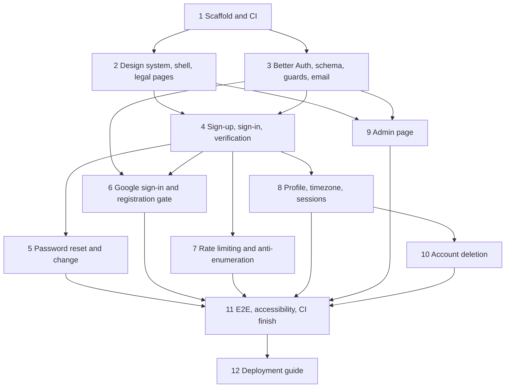

# Implementation Plan

## Overview

This plan implements spec `01-foundation-auth` following `design.md`: the Next.js project skeleton and CI, the pastel design system and app shell, Better Auth with Google and email/username + password, verification, password reset, rate limiting, profile and timezone settings, the registration flag, the Admin page, account deletion, and the legal pages. Twelve top-level tasks, each ending in something runnable or testable.

Scope note: Scholarly serves at most about 10 people. Every task takes the simplest implementation that satisfies its acceptance criteria: one Postgres database, no caches or queues, no extra services beyond those in `tech.md`. Requirement references use this spec's numbering (`4.3` = Requirement 4, criterion 3, which is F1-R4.3 in `docs/REQUIREMENTS.md`). Tasks marked with `*` are optional property-based tests; run them when time allows.

## Tasks

- [x] 1. Scaffold the web project and CI
- [x] 1.1 Create the Next.js application in `web/`
  - Initialize Next.js 16 (App Router, TypeScript `strict`, ESLint, Prettier), Tailwind CSS v4, React 19; set `engines.node` to 22 and add `.nvmrc`
  - Add npm scripts: `dev`, `build`, `start`, `lint`, `typecheck`, `test:unit`, `test:api`, `test:e2e`, `db:generate`, `db:migrate`
  - Configure Vitest with two projects (`node` for `lib/**`, `jsdom` for components with Testing Library) and add `fast-check`; configure Playwright with a `webServer` that builds and starts the app
  - Create `web/.env.example` listing every variable from `tech.md` with placeholder values and no secrets
  - Create the folder layout from `structure.md` (`app/(auth)`, `app/(app)`, `app/api`, `components/ui`, `components/shell`, `lib/domain`, `lib/db`, `lib/auth`, `lib/email`, `emails`, `tests/unit`, `tests/api`, `tests/e2e`)
  - _Requirements: 1.1, 1.7, 1.8_

- [x] 1.2 Add validated environment and structured logging
  - Implement `lib/env.ts` with a Zod schema for the variables in the design (required now: `DATABASE_URL`, `BETTER_AUTH_SECRET`, `BETTER_AUTH_URL`, `GOOGLE_CLIENT_ID`, `GOOGLE_CLIENT_SECRET`, `RESEND_API_KEY`, `EMAIL_FROM`, `NEXT_PUBLIC_APP_URL`; defaults for `ADMIN_EMAILS`, `REGISTRATION_OPEN`; optional `EMAIL_TRANSPORT`, `E2E_TEST_MODE`; later-spec variables optional)
  - Add `instrumentation.ts` whose `register()` imports `lib/env.ts` so startup fails on invalid configuration and logs only variable names
  - Implement `lib/log.ts` (JSON lines with `requestId`, `userId`, `route`, `status`, `durationMs`) and a `redact` helper that strips `email`, `name`, `password`, `token`, `cookie`
  - Write unit tests: missing and malformed variables produce an error listing exactly the offending names; `redact` removes sensitive keys
  - _Requirements: 1.3_

- [x]* 1.3 Property test for environment validation
  - For random subsets of required keys removed from a valid environment, assert the error lists exactly those keys and never a value (Property 12)
  - _Requirements: 1.3_

- [x] 1.4 Add the database client, Drizzle configuration, and health endpoint
  - Implement `lib/db/client.ts` with `pg.Pool` (max 5, SSL when the URL requires it) wrapped by Drizzle; add `drizzle.config.ts` pointing at `lib/db/schema` and `lib/db/migrations`
  - Implement `app/api/health/route.ts`: `SELECT 1` with a 2 s timeout; `200 { status: "ok", db: "ok" }` or `503 { status: "degraded", db: "unreachable" }`
  - Use Neon branches instead of a local database (no Docker or local Postgres install): document creating `dev` and `test` branches from the Neon project, setting `DATABASE_URL` to the `dev` branch and `DATABASE_URL_TEST` to the `test` branch; API tests reset the `test` branch's tables between runs
  - Write API tests for the health route: 200 against the test database, 503 when the pool points at a closed port
  - _Requirements: 1.2, 1.4_

- [x] 1.5 Add the GitHub Actions workflow
  - Create `.github/workflows/ci.yml` with parallel jobs `lint-typecheck`, `unit`, `api` (Postgres 16 service container), `build`, `e2e` (Playwright browsers cached), and `audit` (`npm audit --audit-level=high`), all on Node 22 with `npm ci` caching
  - Add a `migrate` job that runs `drizzle-kit migrate` with the `DATABASE_URL` secret on pushes to `main` only
  - Keep total wall time under 10 minutes; record job durations in the workflow summary
  - _Requirements: 1.5, 1.6_

- [ ] 2. Build the design system, app shell, and legal pages
- [x] 2.1 Define theme tokens and install UI primitives
  - Add the pastel tokens from `tech.md` to `app/globals.css` using Tailwind v4 `@theme` (colors, `--font-sans`, `--radius-xl`, `--shadow-soft`) and map shadcn/ui semantic variables to them as specified in the design (ink text on pastel surfaces, `--primary` ink, `--destructive` deep rose)
  - Initialize shadcn/ui for Tailwind v4 and add: button, input, label, card, dialog, dropdown-menu, avatar, badge, skeleton, sonner, tabs, switch, command, tooltip, sheet, separator, alert
  - Load Inter through `next/font/google` as `--font-inter`; add the global `:focus-visible` ring and the `prefers-reduced-motion` rule; keep transition utilities at 150–200 ms
  - Write a unit test that computes WCAG contrast for every text/surface pair in the token map and fails below 4.5:1 (Property 9)
  - _Requirements: 2.1, 2.2, 2.6, 2.7, 2.8_

- [x] 2.2 Build the app shell and empty states
  - Create `app/(app)/layout.tsx` with `components/shell/top-nav.tsx` (visible at ≥ 1024 px: Home, Sessions, Calendar, bell, profile menu) and `bottom-nav.tsx` (below 1024 px: Home, Sessions, Calendar, Profile; bell stays in the header), `notification-bell.tsx` placeholder, `profile-menu.tsx` (Settings, Admin when admin, Sign out), `app-footer.tsx`, `page-header.tsx`, `empty-state.tsx`
  - Create `app/(auth)/layout.tsx` without the shell
  - Add `loading.tsx` skeletons for Home and Settings segments, matching the final layouts
  - Create the Home page `app/(app)/page.tsx` with the section skeleton (Live now, Upcoming, Pending invites, Start now, Schedule) rendering empty states; spec 02 fills the data
  - Write component tests: nav variants render the right items, empty state shows explanation and action, skeletons render without data
  - _Requirements: 2.3, 2.4, 2.5, 2.9_

- [x] 2.3 Add the privacy and terms pages
  - Create static `app/privacy/page.tsx` and `app/terms/page.tsx` covering the data collected, third-party services (Google sign-in, LiveKit, Neon, Vercel, Resend, Cloudflare R2, Modal), Phase 2 recording behavior and deletion timelines, and how to delete an account
  - Link both pages from the sign-up page and the footer
  - _Requirements: 12.1, 12.2, 12.3_

- [x] 2.4 Enforce the JavaScript budget in CI
  - Write `scripts/check-bundle-budget.mjs` that reads `.next/app-build-manifest.json` after `next build`, sums gzipped chunk sizes per route, and fails when any route except `/sessions/[id]/room` exceeds 200 KB; call it from the `build` job
  - _Requirements: 2.10_

- [ ] 3. Set up Better Auth, database schema, guards, and email
- [x] 3.1 Create the database schema and first migration
  - Generate the Better Auth tables with `npx @better-auth/cli generate` (user with `username` and `display_username`, session, account, verification, rate_limit) into `lib/db/schema/auth.ts`
  - Add `lib/db/schema/settings.ts` with `user_settings` (defaults from the design), `auth_attempts`, and `email_outbox`; re-export from `schema/index.ts`; all foreign keys to `user.id` use `ON DELETE CASCADE`
  - Generate and commit the first migration with `drizzle-kit generate`
  - _Requirements: 1.2, 8.1, 11.2_

- [ ] 3.2 Configure the Better Auth instance, handler, client, and guards
  - Implement `lib/auth/auth.ts` per the design: Drizzle adapter, `emailAndPassword` (`enabled`, `autoSignIn: false`, `minPasswordLength: 10`, `revokeSessionsOnPasswordReset: true`), `emailVerification` (`sendOnSignUp`, `expiresIn` 24 h, `autoSignInAfterVerification`), `session` (30 days, `updateAge` 24 h, `freshAge` 15 min, cookie cache 60 s), `rateLimit` (`storage: "database"`, custom rules from the design), `advanced.ipAddress.ipAddressHeaders`, `disabledPaths: ["/is-username-available"]`, `username` plugin (3–20, `[a-z0-9_]`, post-normalization validation), `nextCookies()` last
  - Add `databaseHooks.user.create.after` that inserts the `user_settings` row
  - Mount `app/api/auth/[...all]/route.ts` with `toNextJsHandler(auth)`; create `lib/auth/client.ts` with `usernameClient()` and a global 429 handler reading `Retry-After` or `X-Retry-After`
  - Implement `lib/auth/guards.ts`: `getSession`, `requireUser(next)`, `requireAdmin`, `isAdmin`; write unit tests for `isAdmin` parsing
  - Confirm the installed version's endpoint path strings and record them in `lib/auth/paths.ts`
  - _Requirements: 4.2, 4.9, 9.1, 9.2, 10.3_

- [ ]* 3.3 Property test for admin membership
  - For random email lists with varied case and whitespace, `isAdmin` is true exactly for listed addresses (Property 8)
  - _Requirements: 10.3, 10.5_

- [x] 3.4 Add request proxy and security headers
  - Implement `web/proxy.ts`: per-request CSP nonce and `Content-Security-Policy` per the design, `x-nonce` and `x-request-id` headers, and optimistic redirect to `/sign-in?next=<path>` for `(app)` routes without a session cookie
  - Add HSTS, `X-Content-Type-Options`, `Referrer-Policy`, and `Permissions-Policy` in `next.config.ts` `headers()`
  - Write an API test asserting the headers on a page response and the redirect for an unauthenticated `(app)` request
  - _Requirements: 9.5_

- [ ] 3.5 Implement email transports and templates
  - Implement `lib/email/transport.ts` (`EmailTransport`, `ResendTransport` from `EMAIL_FROM` as "Scholarly", `CaptureTransport` writing `email_outbox` only when `EMAIL_TRANSPORT=capture` and `E2E_TEST_MODE=true`) and `lib/email/send.ts` with `sendInBackground`
  - Create React Email templates `emails/verify-email.tsx`, `emails/reset-password.tsx`, `emails/account-exists.tsx` with plain-text alternatives
  - Add `app/api/test/outbox/route.ts` returning captured emails for a recipient, responding 404 unless `E2E_TEST_MODE=true`
  - Wire `sendVerificationEmail` and `sendResetPassword` in the auth instance to the templates
  - _Requirements: 5.1, 6.2_

- [ ] 4. Implement sign-up, sign-in, sign-out, and email verification
- [ ] 4.1 Build the sign-up flow
  - Create `app/(auth)/sign-up/page.tsx` with a client form (email, username, display name, password) validated by `signUpSchema` in `lib/validation/auth.ts`; call `authClient.signUp.email`; on success navigate to `/check-email` (no session), which offers "Sign in now"
  - Show "That username is taken" on the username error; show the same "Check your email" page for an existing email
  - Hide sign-up entry points and show "Scholarly is not accepting new accounts right now" when `REGISTRATION_OPEN` is false
  - Write API tests: sign-up creates user and settings without a `Set-Cookie`; duplicate username rejected with the message
  - _Requirements: 4.1, 4.2, 4.4, 4.6, 10.2_

- [ ] 4.2 Enforce the password policy
  - Add `lib/auth/common-passwords.txt` (10,000 lowercase entries from a permissively licensed list, license noted in the header) and `lib/auth/password-policy.ts` loading it into a `Set`; implement `isAcceptablePassword`
  - Enforce it in `hooks.before` for `/sign-up/email`, `/reset-password`, `/change-password`, and `/set-password`, rejecting with "Choose a longer or less common password"
  - Write unit tests for length and denylist cases and an API test that a denylisted password is rejected on sign-up
  - _Requirements: 4.3_

- [ ]* 4.3 Property test for the password policy
  - For random strings, `isAcceptablePassword` accepts exactly those with length ≥ 10 whose lowercase form is not in the denylist (Property 3)
  - _Requirements: 4.3_

- [ ] 4.4 Build the sign-in and sign-out flow
  - Create `app/(auth)/sign-in/page.tsx` with identifier + password; route identifiers containing `@` to `authClient.signIn.email` and others to `authClient.signIn.username`; on success go to `next` or Home
  - Map `?error=` codes (`registration_closed`, `email_not_verified`, `oauth_failed`) and `?reset=1` to messages; show "Incorrect email/username or password" for credential failures
  - Add Sign out (current session) in the profile menu
  - Write API tests: sign-in by email and by username; identical message for unknown identifier and wrong password; sign-out invalidates the session
  - _Requirements: 4.7, 4.8, 9.3, 3.6_

- [ ] 4.5 Build email verification pages, banner, and resend cooldown
  - Create `app/(auth)/verify-email/page.tsx` handling `?error=invalid_token` and expired links with "Send a new link", and `app/(auth)/verified/page.tsx` confirming verification with a link to Home
  - Add `components/shell/unverified-banner.tsx` (dismiss stored in `sessionStorage`, returns next sign-in) with a Resend action calling `authClient.sendVerificationEmail`
  - Enforce a 60-second resend cooldown per account in `hooks.before` using `auth_attempts`
  - Treat Google emails as verified (Better Auth default) and cover it in a test
  - Write API tests: verification link from the outbox marks the email verified and sets a session cookie; second resend within 60 s is rejected
  - _Requirements: 5.1, 5.2, 5.3, 5.4, 5.5, 5.7_

- [ ] 5. Implement password reset and change
- [ ] 5.1 Build the forgot and reset flow
  - Create `app/(auth)/forgot-password/page.tsx` calling `authClient.requestPasswordReset` and always showing "If an account exists for that email, we sent a reset link"
  - Create `app/(auth)/reset-password/page.tsx` reading the token, validating the new password, calling `authClient.resetPassword`, then navigating to `/sign-in?reset=1`; handle expired or used tokens with a link to request a new one
  - Write API tests: reset link from the outbox updates the password and revokes all sessions; expired token rejected; unknown email returns the same response as a known one
  - _Requirements: 6.1, 6.2, 6.3, 6.4_

- [ ] 5.2 Build change password and set password
  - In Settings › Account, add change password (`authClient.changePassword` with `revokeOtherSessions: true`) requiring the current password, and "Set a password" for accounts without a credential account that starts the reset-email flow
  - Write API tests: change password with a wrong current password fails; success keeps the current session and revokes others
  - _Requirements: 6.5, 6.6_

- [ ] 6. Implement Google sign-in, username derivation, and the registration gate
- [ ] 6.1 Implement username derivation
  - Implement `lib/domain/username.ts` (`deriveUsername`) and `lib/auth/username.ts` (`ensureUsername` with numeric suffixes on collision) and wire `databaseHooks.user.create.before`
  - Write unit tests for normalization, truncation to 20, padding to 3, and collision suffixes
  - _Requirements: 3.2_

- [ ]* 6.2 Property tests for username derivation
  - Derived usernames always match `/^[a-z0-9_]{3,20}$/` and derivation is idempotent (Property 1); collision resolution returns an unused name within 20 characters and terminates (Property 2)
  - _Requirements: 3.2_

- [ ] 6.3 Configure Google and the identity gate
  - Add `socialProviders.google` (`prompt: "select_account"`, sign-in scopes only) and keep account linking enabled so a verified Google email links to an existing account
  - Implement `lib/auth/validate-user-info.ts` returning `registration_closed` when creating a user while `REGISTRATION_OPEN` is false and `email_not_verified` for Google profiles with `email_verified: false`; wire `user.validateUserInfo`
  - Add "Continue with Google" to sign-in and sign-up pages with `callbackURL` preserving `next`
  - Write unit tests for the validator with OAuth `source` objects and API tests for closed registration on email sign-up
  - _Requirements: 3.1, 3.2, 3.3, 3.4, 3.5, 3.6, 10.1_

- [ ] 7. Add rate limiting and anti-enumeration hardening
- [ ] 7.1 Implement the per-identifier limiter and the sign-up IP rule
  - Implement `lib/domain/rate-limit.ts` (`computeRetryAfter`) and `lib/auth/identifier-limit.ts` with the single atomic upsert on `auth_attempts` keyed by `sha256(scope | ip | identifier)`
  - Apply it in `hooks.before` for sign-in (email and username), password-reset request, and verification resend at 5 per 15 minutes, throwing a 429 with a `Retry-After` header and "Too many attempts. Try again in N minutes"; keep the built-in limiter rules including 10 sign-ups per hour per IP
  - Write unit tests for `computeRetryAfter` and API tests: 6th attempt returns 429 with a retry header; the window resets
  - _Requirements: 7.1, 7.2, 7.4_

- [ ]* 7.2 Property test for the fixed-window limiter
  - For random attempt sequences, at most `max` are allowed per window, the first attempt after the window resets the count, and `retryAfterSeconds` is in `(0, window]` (Property 4)
  - _Requirements: 7.1_

- [ ] 7.3 Add the response-time floor and enumeration tests
  - Record request start in `hooks.before` (WeakMap keyed by `ctx.request`) and in `hooks.after` await until 350 ms have elapsed for sign-in, sign-up, reset-request, and resend paths
  - Send the "account exists" email from `hooks.before` on `/sign-up/email` when the address is already registered
  - Write API tests: existing and new email sign-ups return the same status and body keys with no `Set-Cookie`, and the outbox holds the "account exists" email (Property 5); mean response times for known and unknown identifiers differ by under 100 ms over 20 samples each (Property 6)
  - _Requirements: 4.5, 7.3_

- [ ] 8. Implement profile settings, timezone, and session management
- [ ] 8.1 Build the settings layout and profile section
  - Create `app/(app)/settings/sections.ts` (Profile, Study target, Notifications, Calendar, Focus analysis, Account) with "Coming soon" cards for sections owned by later specs, and `settings/layout.tsx` rendering them
  - Build `settings/profile`: display name (1–50 trimmed, server action), username change through `authClient.updateUser` with "That username is taken" on conflict, avatar (Google `image` or `InitialsAvatar` with a hue from the user id), read-only email, timezone combobox over `Intl.supportedValuesOf("timeZone")`
  - Write component tests for the profile form and `InitialsAvatar`, and API tests for display-name bounds and username conflict
  - _Requirements: 8.1, 8.2, 8.3, 8.4, 8.6, 8.8_

- [ ] 8.2 Detect and sync the timezone
  - Add `components/settings/timezone-sync.tsx` in `(app)/layout.tsx`: store the browser timezone when none is saved; when it differs from the saved one, show a once-per-browser-session toast offering to switch
  - Validate timezones server-side with `timezoneSchema`
  - Write unit tests for `timezoneSchema` and a component test for the prompt logic
  - _Requirements: 8.5, 8.6, 8.7_

- [ ]* 8.3 Property test for timezone validation
  - Random strings are rejected unless they are members of `Intl.supportedValuesOf("timeZone")` (Property 10)
  - _Requirements: 8.5, 8.6_

- [ ] 8.4 Add "Sign out everywhere" and session lifetime tests
  - Add "Sign out everywhere" in Settings › Account calling `authClient.revokeSessions()` then `signOut()`
  - Write API tests: all sessions revoked; session expiry is 30 days after use and is not extended within 24 hours of the previous extension (mocked clock, Property 7); cookie carries `HttpOnly`, `Secure`, `SameSite=Lax`
  - _Requirements: 9.1, 9.2, 9.4_

- [ ] 9. Build the Admin page
  - Create `app/(app)/admin/page.tsx` guarded by `requireAdmin()` with `UserStats` (total users, created in the last 30 days) and a `UsageStats` slot that renders "Usage counters appear once sessions exist" until spec 02 provides `usage_counters`
  - Show the Admin entry in the profile menu only for admins
  - Write API tests: non-admin receives 404; admin sees counts
  - _Requirements: 10.3, 10.4, 10.5_

- [ ] 10. Implement account deletion
  - Implement `lib/auth/deletion.ts` (`registerDeletionHandler`, `runDeletionHandlers`) and wire `user.deleteUser` (`enabled`, `beforeDelete`, `afterDelete` logging the user id)
  - Build Settings › Account "Delete account": typed-username confirmation enabling the button, `deleteAccountAction` verifying the username and the 15-minute session freshness (return `needsReauth` and route to sign-in when stale), `auth.api.deleteUser`, then redirect to `/goodbye` signed out
  - Write API tests: deletion removes the user, sessions, accounts, and `user_settings`; a stale session gets `needsReauth`; foreign-key scan shows no rows referencing the deleted id (Property 11)
  - _Requirements: 11.1, 11.2, 11.4, 11.6_

- [ ] 11. Add end-to-end tests, accessibility checks, and finish CI
  - Write Playwright tests against the built app with `E2E_TEST_MODE=true` and `EMAIL_TRANSPORT=capture`: sign-up → check-email → outbox link → verified and signed in on Home; sign-in with email and with username; forgot → reset → "Password updated" → sign-in with the new password; sign-out; protected route redirect and return through `next` (Property 13)
  - Add a second Playwright project or CI step starting the server with `REGISTRATION_OPEN=false` and asserting the closed message and hidden entry points
  - Add `@axe-core/playwright` scans on sign-in, sign-up, settings, and privacy pages with zero serious or critical violations
  - Make the `e2e` CI job run these and confirm the full workflow completes under 10 minutes
  - _Requirements: 1.5, 1.6, 2.2, 9.5, 10.1, 10.2_

- [ ] 12. Write the deployment guide
  - Create `docs/DEPLOYMENT.md`: creating the Neon project and pooled `DATABASE_URL`, the Google Cloud OAuth client (authorized origins and redirect URI `/api/auth/callback/google`, privacy policy URL), Resend domain and API key, Vercel project with root directory `web/` and all environment variables, running the first migration, setting `ADMIN_EMAILS`, and how to close registration
  - Add a `web/README.md` with local setup (Neon `dev` and `test` branches, `.env`, `npm run db:migrate`, `npm run dev`) and the test commands; note that CI uses a Postgres service container on GitHub's runners, so nothing needs to be installed locally
  - _Requirements: 1.7_

## Task Dependency Graph



Execution waves (tasks within a wave are independent and may run in parallel):

```json
{
  "tasks": [
    { "id": "1", "dependsOn": [] },
    { "id": "2", "dependsOn": ["1"] },
    { "id": "3", "dependsOn": ["1"] },
    { "id": "4", "dependsOn": ["2", "3"] },
    { "id": "5", "dependsOn": ["4"] },
    { "id": "6", "dependsOn": ["4"] },
    { "id": "7", "dependsOn": ["4"] },
    { "id": "8", "dependsOn": ["4"] },
    { "id": "9", "dependsOn": ["2", "3"] },
    { "id": "10", "dependsOn": ["8"] },
    { "id": "11", "dependsOn": ["5", "6", "7", "8", "9", "10"] },
    { "id": "12", "dependsOn": ["11"] }
  ],
  "waves": [
    { "wave": 1, "tasks": ["1"] },
    { "wave": 2, "tasks": ["2", "3"] },
    { "wave": 3, "tasks": ["4", "9"] },
    { "wave": 4, "tasks": ["5", "6", "7", "8"] },
    { "wave": 5, "tasks": ["10"] },
    { "wave": 6, "tasks": ["11"] },
    { "wave": 7, "tasks": ["12"] }
  ]
}
```

## Notes

- Requirement references use this spec's numbering: `4.3` is Requirement 4, criterion 3 (F1-R4.3 in `docs/REQUIREMENTS.md`).
- Tasks marked `*` are optional property-based tests (fast-check); the corresponding example-based tests in the parent tasks are required.
- Build and test before every commit; use Conventional Commits (`feat`, `fix`, `test`, `chore`, `docs`) with the requirement IDs in the body.
- Confirm the version-specific items listed at the end of `design.md` (Better Auth endpoint paths, `APIError` headers, Vercel IP header, build manifest shape, shadcn CLI flags) when the relevant task starts, and record the results in code comments or `web/README.md`.
- Anything owned by later specs (sessions, notifications, calendar, analysis) is out of scope here; leave extension slots as described in the design.
