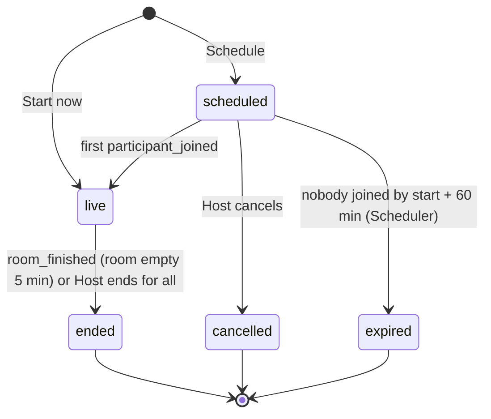

# Requirements Document

## Introduction

This spec delivers the core of Scholarly (Phase 1): private video study sessions. Students start a session now or schedule one, invite friends by username or email or through a revocable private link, and join a LiveKit room from a pre-join screen. It covers the session lifecycle, access control through server-issued room tokens, the in-room experience (adaptive grid, controls, host actions), presence tracking from LiveKit webhooks, camera-on tracking from client reports and heartbeats, monthly usage caps, and the Home, session detail, and sessions list pages.

Steering files `.kiro/steering/product.md`, `tech.md`, and `structure.md` apply. The consolidated source of truth is `docs/REQUIREMENTS.md` (section F2); requirement IDs below match it.

### Session state machine

## Glossary

| Term | Meaning |
|---|---|
| Web App | The browser-side Next.js UI. |
| API | The Next.js server: route handlers and server actions. |
| SFU | The LiveKit server (LiveKit Cloud or self-hosted), reached only through `LIVEKIT_URL`, `LIVEKIT_API_KEY`, `LIVEKIT_API_SECRET`. |
| Scheduler | The idempotent jobs executed by `POST /api/cron/dispatch`, triggered every 5 minutes (defined fully in spec 05; this spec defines the jobs it needs). |
| Session | A private video meeting for studying with status `scheduled`, `live`, `ended`, `cancelled`, or `expired`. |
| Instant session | Created with "Start now"; `live` immediately. |
| Scheduled session | Has `scheduled_start` and `scheduled_end`; joinable from 10 minutes before the start. |
| Host | The Student who created the session. |
| Invitee | A Student with an invite (`pending`, `accepted`, `declined`, or `revoked`) to a session. |
| Invite link | `/join/<token>`; a per-session URL with a secret token the Host can enable, disable, or regenerate. |
| Joinable | `live`, or `scheduled` with the current time at or after `scheduled_start − 10 minutes`. |
| Room token | A LiveKit access token issued by the API for one room, one user, 1-hour TTL. |
| Participation | One presence in the room from `participant_joined` to `participant_left`, confirmed by SFU webhooks. |
| Camera report | A client message stating `cameraOn` true or false at a timestamp (state change or 60-second heartbeat). |
| Camera interval | A derived period during which the camera was on, clipped to the participation window. |
| Cap | Monthly participant-minute limit per user (`MONTHLY_MINUTES_PER_USER`) and global (`MONTHLY_MINUTES_GLOBAL`). |

## Dependencies

- Spec 01 (`01-foundation-auth`): accounts, auth sessions, profile timezone, app shell, Admin page, `/api/health`, CI.
- Notifications referenced here (`invite_received`, `invite_accepted`, `invite_declined`, `session_rescheduled`, `session_cancelled`, `usage_cap_warning`) are emitted through the `notify()` function whose delivery channels are defined in spec 05; until spec 05 is implemented, `notify()` writes in-app rows only.

## Requirements

### Requirement 1: Create an instant session (ID: F2-R1)
**User Story:** As a Student, I want to start a study session right now, so that friends can join me immediately.

#### Acceptance Criteria

1. WHEN a Student selects "Start now" THEN THE Web App SHALL show a form with a title (default "Study session", 1–80 characters) and an optional description (up to 500 characters).
2. WHEN the form is submitted THEN THE API SHALL create a session with `kind = instant`, `status = live`, `started_at = now`, `livekit_room_name = session-<id>`, and the creator as Host.
3. WHEN creation succeeds THEN THE Web App SHALL show the pre-join screen (F2-R9) within 1 s.
4. IF the Host already has another `live` session THEN THE API SHALL refuse creation with "End your current live session first".

### Requirement 2: Create a scheduled session (ID: F2-R2)
**User Story:** As a Student, I want to schedule a study session for later, so that friends can plan to join.

#### Acceptance Criteria

1. WHEN a Student selects "Schedule" THEN THE Web App SHALL show a form with title (default "Study session", 1–80 characters), optional description (up to 500 characters), start date and time in the Student's timezone, and duration.
2. THE API SHALL accept a start time only if it is at least 5 minutes in the future and at most 365 days ahead.
3. THE API SHALL accept a duration between 15 minutes and 12 hours in 15-minute steps, defaulting to 60 minutes.
4. WHEN the form is submitted THEN THE API SHALL create a session with `kind = scheduled`, `status = scheduled`, `scheduled_start`, `scheduled_end = scheduled_start + duration`, `version = 1`, and the creator as Host, without creating the SFU room yet.
5. WHEN creation succeeds THEN THE Web App SHALL show the session detail page with invite controls.

### Requirement 3: Edit, reschedule, cancel (ID: F2-R3)
**User Story:** As a Host, I want to change or cancel a scheduled session, so that plans can adapt.

#### Acceptance Criteria

1. WHILE a session is `scheduled` THE API SHALL allow only the Host to edit title, description, start time, and duration.
2. WHEN the start time or duration of a `scheduled` session changes THEN THE API SHALL increment `version` and emit `session_rescheduled` to every pending and accepted Invitee.
3. WHEN the Host cancels a `scheduled` session THEN THE API SHALL set `status = cancelled`, disable the invite link, and emit `session_cancelled` to every pending and accepted Invitee.
4. WHILE a session is `live` THE API SHALL reject edits and cancellation with "Live sessions can only be ended".
5. WHILE a session is `ended`, `cancelled`, or `expired` THE API SHALL reject every modification.
6. IF a non-host attempts any of these operations THEN THE API SHALL respond with HTTP 403.

### Requirement 4: Lifecycle and expiry (ID: F2-R4)
**User Story:** As a Student, I want sessions to move through clear states automatically, so that lists and stats are always accurate.

#### Acceptance Criteria

1. THE API SHALL implement the session state machine shown in the state diagram: `scheduled → live`, `live → ended`, `scheduled → cancelled`, `scheduled → expired`; instant sessions start in `live`.
2. WHEN the first `participant_joined` webhook for a `scheduled` session is processed THEN THE API SHALL set `status = live` and `started_at` to the event timestamp.
3. WHEN a `room_finished` webhook is processed for a `live` session THEN THE API SHALL set `status = ended`, set `ended_at` to the event timestamp, and close every open participation and camera interval of that session at that time.
4. WHEN the Host selects "End for all" THEN THE API SHALL delete the room on the SFU, set `status = ended` and `ended_at = now` immediately, and ignore the later `room_finished` for that room.
5. WHEN the Scheduler runs THEN THE Scheduler SHALL set `status = expired` on every `scheduled` session whose `scheduled_start` is more than 60 minutes in the past and that has no participations.
6. THE API SHALL create the SFU room with `emptyTimeout = 300` seconds and `maxParticipants = 10` before issuing the first token for a session.
7. IF a `live` session has had no connected participants for 30 minutes and no `room_finished` was received THEN THE Scheduler SHALL query the SFU and set `status = ended` when the room no longer exists.

### Requirement 5: Invite by identity (ID: F2-R5)
**User Story:** As a Host, I want to invite specific friends by username or email, so that only they can join.

#### Acceptance Criteria

1. WHEN the Host enters an exact username or exact email address in the invite field THEN THE API SHALL return the single matching registered Student (display name, username, avatar) or "No user found", never partial matches.
2. WHEN the Host confirms an invitee THEN THE API SHALL create an invite with `status = pending`, `via = identity`, and emit `invite_received` to that Student.
3. THE API SHALL allow at most 9 invites in `pending` or `accepted` status per session (10 participants including the Host).
4. IF the Host invites a Student who already has a `pending` or `accepted` invite THEN THE API SHALL respond with "Already invited" and change nothing.
5. WHEN an Invitee accepts THEN THE API SHALL set `status = accepted` and emit `invite_accepted` to the Host.
6. WHEN an Invitee declines THEN THE API SHALL set `status = declined` and emit `invite_declined` to the Host.
7. WHEN the Host revokes an invite THEN THE API SHALL set `status = revoked` and, if that user is connected to the room, remove them from the SFU room.
8. THE Web App SHALL show pending invites to the Invitee on Home and on the session detail page with Accept and Decline actions.
9. THE Web App SHALL show the Host every invitee with status and a Revoke action.
10. WHEN a Student with a `declined` or `revoked` invite is invited again THEN THE API SHALL reuse the invite row and reset it to `pending`.

### Requirement 6: Invite link (ID: F2-R6)
**User Story:** As a Host, I want to share a private link, so that friends can join without me typing their names.

#### Acceptance Criteria

1. WHEN the Host enables the invite link THEN THE API SHALL generate a token with at least 128 bits of cryptographic randomness, encoded URL-safe, and set `link_enabled = true`.
2. WHEN the Host disables the link THEN THE API SHALL set `link_enabled = false` so the URL stops working immediately while keeping the token for re-enabling.
3. WHEN the Host regenerates the link THEN THE API SHALL replace the token and invalidate the previous one immediately.
4. WHEN a signed-in Student opens `/join/<token>` for an enabled link of a `scheduled` or `live` session with invite capacity THEN THE API SHALL create or reactivate an invite with `status = accepted`, `via = link`, and send them to the pre-join screen, or to the session detail page when the session is not yet joinable.
5. WHEN a Visitor opens `/join/<token>` THEN THE Web App SHALL redirect to sign-in (with a sign-up option) and return them to the same link after authentication.
6. IF the token is unknown, the link is disabled, the session is `ended`, `cancelled`, or `expired`, or the invite cap is reached THEN THE Web App SHALL show an error page naming the reason (invalid link, link disabled, session over, session full) without exposing session details.
7. THE Web App SHALL provide a "Copy link" action that copies `NEXT_PUBLIC_APP_URL/join/<token>` and confirms with a toast.
8. THE API SHALL compare link tokens in constant time and never write them to logs.

### Requirement 7: Access control and room tokens (ID: F2-R7)
**User Story:** As a Host, I want only invited people to be able to enter my session, so that it stays private.

#### Acceptance Criteria

1. WHEN a Student requests to join a session THEN THE API SHALL issue an SFU token only if the Student is the Host or holds an `accepted` invite and the session is joinable (F2-R8).
2. THE API SHALL issue tokens with a 1-hour TTL scoped to the session's room only, `identity` = user id, `name` = display name, and `canPublish`, `canSubscribe`, and `canPublishData` grants; Host tokens additionally carry `roomAdmin`.
3. IF a token request is denied THEN THE API SHALL respond with HTTP 403, one reason code from `not_invited`, `not_open_yet`, `ended`, `cancelled`, `full`, `cap_reached`, and a human-readable message.
4. THE API SHALL never expose `LIVEKIT_API_SECRET` or issue a token for a user other than the requester.
5. WHEN the Web App needs to reconnect after a network interruption THEN THE Web App SHALL request a fresh token from the API instead of reusing an expired one.

### Requirement 8: Join rules (ID: F2-R8)
**User Story:** As an Invitee, I want to know exactly when I can join, so that I am never confused at the door.

#### Acceptance Criteria

1. THE API SHALL consider a session joinable when its status is `live`, or its status is `scheduled` and the current time is at or after `scheduled_start − 10 minutes`.
2. IF 10 participants are currently connected THEN THE API SHALL deny a further token with reason `full`.
3. IF the requester's or the global monthly participant-minute usage has reached its cap THEN THE API SHALL deny the token with reason `cap_reached` (F2-R13).
4. WHEN a session is not yet joinable THEN THE Web App SHALL show a countdown to the join window and enable the Join button automatically when the window opens, without a page reload.

### Requirement 9: Pre-join screen (ID: F2-R9)
**User Story:** As a Student, I want to check my camera and mic before entering, so that I join looking and sounding right.

#### Acceptance Criteria

1. WHEN a Student opens the pre-join screen THEN THE Web App SHALL request camera and microphone permissions and show a live camera preview.
2. THE Web App SHALL default the camera to on and the microphone to muted on the pre-join screen and on entering the room.
3. THE Web App SHALL let the user choose camera, microphone, and speaker devices and remember the choices in localStorage for the next session.
4. IF camera or microphone permission is denied THEN THE Web App SHALL show browser-specific guidance for enabling permissions and still allow joining with the denied device off.
5. WHEN the user selects "Join" THEN THE Web App SHALL request a token (F2-R7), connect to the SFU, and show the first remote video within 3 s on a good network.

### Requirement 10: In-room experience (ID: F2-R10)
**User Story:** As a Student, I want to see my friends studying in a clean, distraction-free room, so that I feel accompanied without being pulled away from my work.

#### Acceptance Criteria

1. WHILE connected THE Web App SHALL lay out participant tiles in an adaptive grid: 1 column for 1 participant, 2 columns for 2–4, 3 columns for 5–9, 4 columns for 10 on viewports 768 px and wider; 1–2 columns below 768 px.
2. THE Web App SHALL show on each tile the display name, a microphone-state icon, and, when the camera is off, a placeholder with the participant's initials on their avatar color.
3. THE Web App SHALL show the local user's video as a tile labelled "You".
4. THE Web App SHALL provide controls to toggle microphone, toggle camera, switch devices, and leave, each keyboard-operable with an accessible label.
5. THE Web App SHALL show the elapsed time since `started_at`, the participant count, and a per-participant connection-quality indicator.
6. WHILE the local user is the Host THE Web App SHALL show a "Remove" action on every other participant's tile and an "End for all" control with a confirmation step.
7. WHEN the Host removes a participant THEN THE API SHALL remove that participant from the SFU room.
8. WHEN a participant is removed by the Host THEN THE Web App SHALL show them "You were removed by the host" and return them to the session detail page.
9. WHEN the connection is interrupted THEN THE Web App SHALL show a "Reconnecting" state and resume automatically, requesting a new token if needed.
10. THE Web App SHALL load the LiveKit client bundle only on the room route.
11. THE Web App SHALL provide no text chat and no screen sharing in Phase 1.
12. WHEN the user leaves or closes the tab THEN THE Web App SHALL disconnect from the SFU explicitly so `participant_left` fires promptly.

### Requirement 11: Presence tracking via webhooks (ID: F2-R11)
**User Story:** As a Student, I want my presence in sessions recorded reliably, so that history and study time are trustworthy.

#### Acceptance Criteria

1. WHEN a request arrives at `POST /api/webhooks/livekit` THEN THE API SHALL verify the JWT signature in the `Authorization` header with the LiveKit API key and secret and reject unverifiable requests with HTTP 401.
2. WHEN a verified webhook event arrives THEN THE API SHALL store its event id in `webhook_events` and ignore any event whose id is already stored.
3. WHEN `participant_joined` is processed THEN THE API SHALL open a participation for the user identified by the participant identity with `joined_at` = event timestamp.
4. WHEN `participant_left` or `participant_connection_aborted` is processed THEN THE API SHALL close the matching open participation with `left_at` = event timestamp and close any open camera interval of that participation at the same time.
5. IF events arrive out of order THEN THE API SHALL derive the participation window from the event timestamps rather than the arrival order.
6. IF a webhook references a room that matches no session THEN THE API SHALL log a warning with the room name and respond with HTTP 200.
7. THE API SHALL respond to webhooks within 300 ms at p95 by deferring notifications and rollups until after the response is sent.

### Requirement 12: Camera-on tracking (ID: F2-R12)
**User Story:** As a Student, I want only my camera-on time to count as study time, so that the numbers reflect real accompanied study.

#### Acceptance Criteria

1. WHILE connected to a room THE Web App SHALL post a camera state report to the API within 2 s of the local camera being enabled or disabled (publish, unpublish, mute, or unmute).
2. WHILE connected to a room THE Web App SHALL post a heartbeat every 60 s containing `sessionId` and `cameraOn`.
3. THE API SHALL persist every camera report (user, session, `cameraOn`, timestamp) and derive camera intervals as the periods from a `cameraOn = true` report to the next `cameraOn = false` report of the same participation.
4. WHEN no heartbeat or state report has been received for 3 minutes THEN THE Scheduler SHALL close the open camera interval at the time of the last received report.
5. THE API SHALL clip every camera interval to its webhook-confirmed participation window so camera-on time never exceeds presence time.
6. IF two camera intervals of the same user overlap THEN THE API SHALL count the overlapping seconds once.
7. WHEN a camera interval closes or extends THEN THE API SHALL update `daily_totals` for the affected user and local dates (F3-R5).
8. IF a camera report arrives for a session in which the user is neither Host nor accepted Invitee THEN THE API SHALL respond with HTTP 403.

### Requirement 13: Usage caps (ID: F2-R13)
**User Story:** As the owner, I want video usage capped per user and overall, so that a stranger cannot exhaust the free tier.

#### Acceptance Criteria

1. THE API SHALL accumulate participant-seconds per user and globally per UTC calendar month from participations, counting open participations up to the current time when checking caps.
2. WHEN a token is requested and the requester's month total is at or above `MONTHLY_MINUTES_PER_USER` or the global total is at or above `MONTHLY_MINUTES_GLOBAL` THEN THE API SHALL deny it with reason `cap_reached` and a message stating when the cap resets.
3. WHEN usage for a user or globally first crosses 80% and then 100% of a cap within a month THEN THE API SHALL emit `usage_cap_warning` to every Admin once per threshold per month.
4. THE Web App SHALL show Admins the current month's per-user and global usage against caps.
5. THE API SHALL read cap values from the environment at startup with defaults 1,500 minutes per user and 4,500 minutes global.

### Requirement 14: Home page (ID: F2-R14)
**User Story:** As a Student, I want Home to show what is happening now and next, so that joining or starting takes one click.

#### Acceptance Criteria

1. WHEN a Student opens Home THEN THE Web App SHALL show "Live now" (hosted or accepted sessions that are `live`), "Upcoming" (hosted or accepted `scheduled` sessions in the next 7 days, soonest first), "Pending invites", and the buttons "Start now" and "Schedule".
2. WHILE Home is open THE Web App SHALL refresh live status every 30 s and when the window regains focus.
3. THE Web App SHALL show on each session card the title, host, up to 5 participant avatars plus a count, the start time in the user's timezone, and a Join or View action reflecting joinability.
4. IF a section is empty THEN THE Web App SHALL show that section's empty state (for example "No live sessions. Start one?").

### Requirement 15: Session detail page (ID: F2-R15)
**User Story:** As a Student, I want one page with everything about a session, so that I can manage or join it.

#### Acceptance Criteria

1. THE Web App SHALL show title, description, status, kind, scheduled start and end (or started and ended times), host, and the participant list with invite statuses.
2. WHILE the viewer is the Host THE Web App SHALL show invite search, invite link controls (enable, disable, regenerate, copy), Edit and Cancel for `scheduled` sessions, and "End for all" for `live` sessions.
3. THE Web App SHALL show a Join button whose state reflects joinability, with a countdown when the window has not opened.
4. THE Web App SHALL reserve space for the calendar actions of F4 and a "Focus report" tab of F6, hidden until those specs are implemented.
5. IF the viewer is neither Host nor Invitee THEN THE API SHALL respond with HTTP 404 for the session.

### Requirement 16: Sessions list (ID: F2-R16)
**User Story:** As a Student, I want to browse my sessions, so that I can find upcoming, past, and hosted ones.

#### Acceptance Criteria

1. THE Web App SHALL provide a Sessions page with tabs Upcoming (hosted or accepted `scheduled`), Past (`ended` sessions the user attended), and Hosted (every session the user created, any status), each paginated by 20 with "Load more".
2. THE Web App SHALL sort Upcoming ascending by start time and Past and Hosted descending by start time.

## Non-Functional Acceptance Criteria

1. THE Web App SHALL show the first remote participant's video within 3 s of selecting "Join" on a network with at least 5 Mbps and under 100 ms latency.
2. THE Web App SHALL keep every route except `sessions/[id]/room` within the 200 KB gzipped JavaScript budget and load the LiveKit client only on the room route.
3. THE API SHALL respond to `POST /api/webhooks/livekit` within 300 ms at p95 and to token issuance within 500 ms at p95.
4. THE Web App SHALL make every room control (microphone, camera, devices, leave, remove, end for all) operable by keyboard with an accessible name, and announce participant joins and leaves through an `aria-live="polite"` region.
5. THE API SHALL verify authorization (Host, accepted Invitee, or Admin) before any read or mutation of a session, invite, token, or camera report.
6. THE Web App SHALL implement joinability, invite capacity, cap arithmetic, and camera-interval derivation as pure functions in `web/lib/domain` with unit tests.
7. THE CI Pipeline SHALL run API tests for every session route (create, edit, cancel, invite, accept, decline, revoke, link enable/disable/regenerate, token, webhook, camera report) and Playwright e2e tests for create, invite, accept, and join with the SFU mocked.
8. THE API SHALL never write room tokens, link tokens, or webhook bodies to logs.

## Out of Scope

- Text chat, screen sharing, reactions, recordings of any kind.
- Dashboard, targets, and history views (spec 03), although this spec produces the participations and camera intervals they consume.
- Calendar actions and feeds (spec 04).
- Email and push delivery of the notifications emitted here (spec 05).
- Focus analysis (spec 06).
- Recurring sessions, waiting rooms, breakout rooms, per-participant permissions beyond Host and Invitee.
