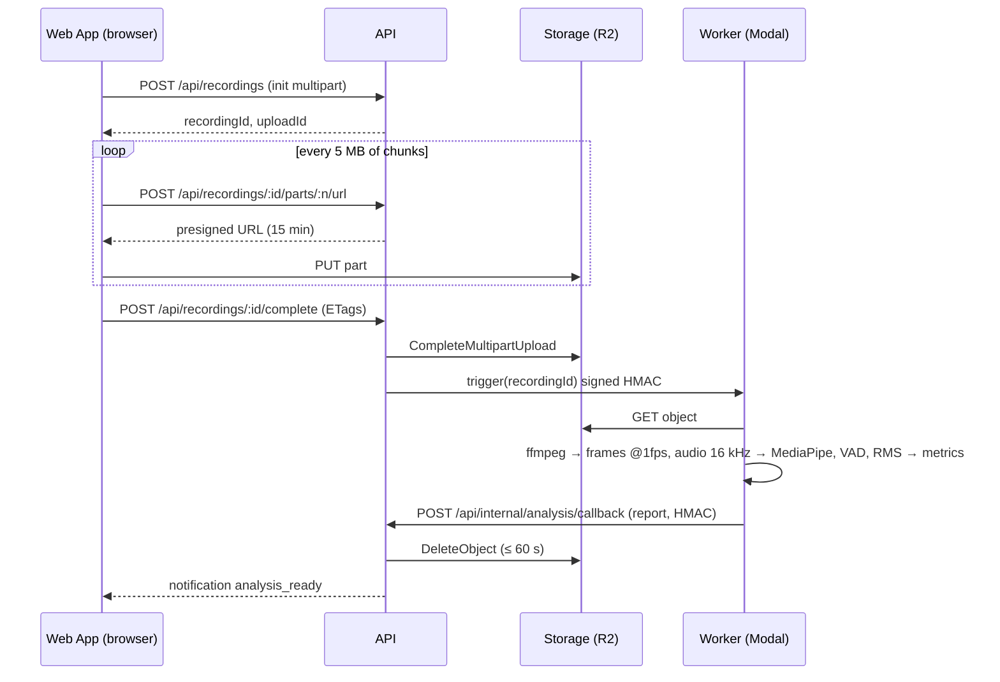

# Requirements Document

## Introduction

This spec delivers Phase 2 of Scholarly: opt-in focus analysis. During a session, a Student's own camera (and, only with a separate opt-in, own microphone) is recorded locally in the browser at 320×240 and 5 fps, buffered in IndexedDB, and uploaded in multipart chunks directly to a private Cloudflare R2 bucket. After the session, a Python worker on Modal downloads the recording, derives per-second states (present, looking away, phone, drowsy, talking, noise, focused) with MediaPipe and a voice-activity detector, computes metrics, episodes, deep-work blocks, and a per-minute timeline, and posts a signed report back to the API. The API stores the report, deletes the recording within 60 seconds, and notifies the Student. Reports are private by default; a Student may share a report with that session's participants and opt into a weekly friends leaderboard.

Other participants are never recorded. Analysis never blocks joining a session.

Steering files `.kiro/steering/product.md`, `tech.md`, and `structure.md` apply. The consolidated source of truth is `docs/REQUIREMENTS.md` (section F6); requirement IDs below match it.

### Recording and analysis flow

## Glossary

| Term | Meaning |
|---|---|
| Web App | The browser-side Next.js UI, including the recorder running in the room route. |
| API | The Next.js server: route handlers and server actions. |
| Worker | The Python 3.11 app on Modal that analyzes recordings. |
| Scheduler | The idempotent jobs executed by `POST /api/cron/dispatch` (spec 05); this spec adds the re-trigger and media-sweep jobs. |
| Storage | The private Cloudflare R2 bucket reached through the S3 API. |
| Database | Neon Postgres. |
| Recording | One Student's own media for one session: a `recordings` row plus one object in Storage until deletion. |
| Part | A multipart-upload part of at least 5 MB (the last may be smaller) uploaded through a presigned URL. |
| Report | The `analysis_reports` row: versioned metrics, episodes, deep-work blocks, and a per-minute timeline. |
| State | The per-second classification: `away`, `phone`, `drowsy`, `looking_away`, `talking`, `noise`, or `focused`, assigned with that precedence. |
| Episode | A contiguous run of one state after smoothing and gap merging, with start and end seconds. |
| Pose baseline | Median yaw and pitch over the first 5 minutes with a face present; deviations beyond 25° yaw or 20° pitch count as looking away. |
| Deep-work block | A run of `focused` seconds of at least `deep_work_block_minutes` (default 25) tolerating interruptions of at most 30 s. |
| Focus score | round(100 × focused_seconds ÷ present_seconds), 0 when present_seconds is 0. |
| Analysis caps | `ANALYSIS_HOURS_PER_USER` (60) and `ANALYSIS_HOURS_GLOBAL` (400) per UTC month. |
| HMAC callback | A request signed with HMAC-SHA256 over `timestamp + "." + body` using `WORKER_SHARED_SECRET`, valid for 5 minutes. |

## Dependencies

- Spec 01 (`01-foundation-auth`): accounts, Settings sections, Admin page, `/privacy`.
- Spec 02 (`02-study-sessions`): the room route and local tracks, pre-join screen, session detail page (report tab slot), participations (who counts as a participant for sharing and leaderboard).
- Spec 03 (`03-dashboard-history`): dashboard (focus score widget is added here).
- Spec 05 (`05-notifications`): `notify()` channels for `analysis_ready`, `analysis_failed`, `report_shared`, `usage_cap_warning`; the Scheduler that runs re-triggers and sweeps.
- External accounts: Cloudflare R2 bucket with lifecycle rule, Modal workspace with `WORKER_TRIGGER_URL` and `WORKER_SHARED_SECRET` configured (documented in `docs/DEPLOYMENT.md`).

## Requirements

### Requirement 1: Settings opt-ins (ID: F6-R1)
**User Story:** As a Student, I want to decide whether my sessions are analyzed, so that recording never happens without my consent.

#### Acceptance Criteria

1. THE Web App SHALL provide Settings › Focus analysis with the toggles "Analyze my study sessions" (video) and "Also analyze audio", a deep-work block length field (10 to 90 minutes, default 25), a "Show me on the weekly leaderboard" toggle, and a default for "Share reports with session participants" (off).
2. THE Web App SHALL keep "Also analyze audio" disabled and off unless the video toggle is on.
3. WHEN the audio toggle is turned on THEN THE Web App SHALL display "This records your microphone for analysis even while you are muted in the call" and require an explicit confirmation.
4. THE Web App SHALL show the consent text of F6-R11 next to the toggles with a link to `/privacy`.
5. THE API SHALL store these settings per user with every toggle defaulting to off.

### Requirement 2: Per-session consent and indicator (ID: F6-R2)
**User Story:** As a Student, I want to confirm analysis for each session and always see when it is running, so that I am never recorded unknowingly.

#### Acceptance Criteria

1. WHILE `analysis_enabled` is on THE Web App SHALL show a "Focus analysis" toggle on the pre-join screen prefilled from settings.
2. WHILE recording THE Web App SHALL show a persistent "Analyzing · REC" indicator on the local tile and in the control bar.
3. WHEN the user turns analysis off during a session THEN THE Web App SHALL stop the recorder, finalize the upload, and request analysis only if at least 5 minutes were captured, otherwise abort and discard the upload.
4. THE Web App SHALL start recording only when the per-session toggle is on.
5. IF an analysis cap (F6-R13) is reached THEN THE Web App SHALL show the toggle disabled with "Monthly analysis limit reached".

### Requirement 3: Local recording pipeline (ID: F6-R3)
**User Story:** As a Student, I want my own camera recorded at low resolution and uploaded reliably, so that analysis works without hurting the call or my bandwidth.

#### Acceptance Criteria

1. THE Web App SHALL record only the local participant's own camera track and, when audio analysis is enabled, own microphone track, never any remote track.
2. THE Web App SHALL include an automated test asserting that no remote track is ever attached to the recorder.
3. THE Web App SHALL draw camera frames onto a 320×240 canvas (letterboxed to preserve aspect ratio) at 5 frames per second and record the canvas stream with `MediaRecorder`.
4. THE Web App SHALL choose the first supported MIME type in the order `video/webm;codecs=vp9`, `video/webm;codecs=vp8`, `video/mp4`, requesting a video bitrate of at most 120 kbps and, when audio is enabled, mono audio at most 32 kbps.
5. WHEN recording starts THEN THE Web App SHALL call `POST /api/recordings` to initialize a multipart upload and receive `recordingId` and `uploadId`.
6. THE Web App SHALL request recorder data every 60 s and append each chunk to IndexedDB before treating it as captured.
7. WHEN buffered chunks reach 5 MB THEN THE Web App SHALL upload them as one part through a presigned URL from `POST /api/recordings/:id/parts/:n/url`, with only the final part allowed to be smaller.
8. WHEN recording ends THEN THE Web App SHALL upload the remaining data and call `POST /api/recordings/:id/complete` with the part ETags.
9. IF a part upload fails THEN THE Web App SHALL retry with exponential backoff from 2 s doubling to a maximum of 60 s for up to 30 minutes, keeping the part in IndexedDB until acknowledged.
10. IF the recording reaches 6 hours or 1 GB THEN THE Web App SHALL stop the recorder and finalize the upload while the call continues without further analysis.
11. WHEN the app is reopened within 24 hours after an interrupted session THEN THE Web App SHALL resume uploading pending parts and complete the upload.
12. IF pending parts are older than 24 hours THEN THE Web App SHALL call `POST /api/recordings/:id/abort` and clear them from IndexedDB.
13. THE Web App SHALL hold at most 10 MB of recording data in memory at any time.

### Requirement 4: Storage rules (ID: F6-R4)
**User Story:** As a Student, I want my recording stored privately and briefly, so that it cannot leak.

#### Acceptance Criteria

1. THE Storage bucket SHALL be private with no public access and no public bucket URL.
2. THE API SHALL use object keys `recordings/<userId>/<sessionId>/<recordingId>.<ext>`.
3. THE API SHALL issue presigned URLs valid for 15 minutes, each bound to one object key, one upload id, and one part number.
4. THE Storage bucket SHALL have a lifecycle rule that deletes objects 2 days after creation and aborts incomplete multipart uploads after 2 days.
5. IF a Student requests a presigned URL for a recording they do not own THEN THE API SHALL respond with HTTP 404.

### Requirement 5: Analysis trigger (ID: F6-R5)
**User Story:** As a Student, I want analysis to start automatically and recover from hiccups, so that reports arrive without me doing anything.

#### Acceptance Criteria

1. WHEN `complete` succeeds THEN THE API SHALL set the recording status to `uploaded`, record `bytes` and `parts_count`, and call `WORKER_TRIGGER_URL` with the recording id, signed with HMAC-SHA256 over `timestamp + "." + body` using `WORKER_SHARED_SECRET`.
2. WHEN the Worker accepts the trigger THEN THE API SHALL set status `processing` and increment `attempts`.
3. WHEN the Scheduler finds a recording in `uploaded` or `processing` for more than 10 minutes without a callback THEN THE Scheduler SHALL re-trigger it if `attempts` is below 3.
4. IF `attempts` reaches 3 without a stored report THEN THE Scheduler SHALL set status `failed`, delete the media (F6-R8), and emit `analysis_failed`.
5. WHEN a recording is initialized THEN THE API SHALL check the per-user and global analysis caps (F6-R13) and refuse with reason `analysis_cap_reached` when either is reached.

### Requirement 6: Worker pipeline (ID: F6-R6)
**User Story:** As a Student, I want an accurate, explainable focus report, so that I can improve how I study.

#### Acceptance Criteria

1. WHEN the Worker receives a valid trigger THEN THE Worker SHALL download the object from Storage to ephemeral disk and read duration and streams with `ffprobe`.
2. THE Worker SHALL extract frames at 1 frame per second as 320×240 JPEG and, when an audio stream exists and the recording has `has_audio`, mono 16 kHz WAV.
3. THE Worker SHALL run MediaPipe Face Landmarker on every frame producing per second `present` (a face detected), `yaw` and `pitch` from the facial transformation matrix, and `eyes_closed` (both `eyeBlinkLeft` and `eyeBlinkRight` blendshapes above 0.5).
4. THE Worker SHALL run the MediaPipe Object Detector (EfficientDet-Lite0) on every second frame and mark `phone` when a "cell phone" detection scores at least 0.5, carrying the value to the following second.
5. WHEN audio is present THEN THE Worker SHALL mark `speaking` per second using webrtcvad at aggressiveness 2 on 30 ms frames (a second is speaking when more than 50% of its frames are speech) and mark `noisy` when the RMS level exceeds the session median by more than 15 dB for at least 3 consecutive seconds.
6. THE Worker SHALL smooth every per-second boolean signal with a 5-second median filter before deriving states.
7. THE Worker SHALL compute the pose baseline as the median yaw and pitch over the first 5 minutes with a face present, falling back to the whole recording when fewer than 60 present seconds exist in the first 5 minutes.
8. THE Worker SHALL classify each second as exactly one state using this precedence: `away` (not present), `phone`, `drowsy` (eyes closed for at least 2 consecutive seconds), `looking_away` (|yaw − baseline| > 25° or |pitch − baseline| > 20°), `talking` (speaking), `noise` (noisy), otherwise `focused`.
9. THE Worker SHALL build episodes per state by merging gaps of at most 5 seconds and dropping episodes shorter than 3 seconds, except `away` episodes, which require at least 10 seconds.
10. THE Worker SHALL compute deep-work blocks as runs of `focused` seconds of at least the user's `deep_work_block_minutes`, where interruptions of at most 30 seconds do not break the run.
11. THE Worker SHALL output `analyzed_seconds`, `present_seconds`, `focused_seconds`, `focus_score` = round(100 × focused_seconds ÷ present_seconds) (0 when present_seconds is 0), `looking_away_seconds`, `phone_seconds`, `speaking_seconds`, `noise_seconds`, `drowsy_seconds`, the episode lists `away_episodes`, `looking_away_episodes`, `phone_episodes`, `talking_episodes`, `noise_episodes`, `drowsy_episodes` (each with `start` and `end` in seconds from recording start), `deep_work_blocks` (start, end), `longest_focus_streak_seconds`, and `timeline` (one entry per minute with the dominant state).
12. THE Worker SHALL include `schema_version` (starting at 1), `model_versions` (Face Landmarker, Object Detector, webrtcvad), and the processing duration in every report.
13. THE Worker SHALL finish within 0.15 × media duration on one CPU core using at most 2 GB of memory (18 minutes for a 2-hour recording).
14. WHEN processing completes or fails THEN THE Worker SHALL call `POST /api/internal/analysis/callback` with the report or an error code, signed with HMAC-SHA256 over `timestamp + "." + body` using `WORKER_SHARED_SECRET`, retrying 3 times with exponential backoff on network errors or HTTP 5xx.
15. WHEN processing ends THEN THE Worker SHALL delete every temporary file and keep no media outside ephemeral disk.
16. THE Worker SHALL implement criteria 6 to 11 as pure functions covered by pytest and a golden report.

### Requirement 7: Callback handling (ID: F6-R7)
**User Story:** As a Student, I want my report stored and my recording gone the moment analysis finishes, so that the promise of deletion is kept.

#### Acceptance Criteria

1. WHEN a callback arrives THEN THE API SHALL verify the HMAC signature and reject requests with an invalid signature or a timestamp older than 5 minutes with HTTP 401.
2. WHEN a valid success callback arrives THEN THE API SHALL store the report in `analysis_reports`, set the recording status to `analyzed`, and ignore duplicate callbacks for the same recording id and attempt.
3. WHEN a report is stored THEN THE API SHALL delete the recording object from Storage (aborting any incomplete multipart upload) within 60 s and set `deleted_at`.
4. WHEN the media deletion is confirmed THEN THE API SHALL emit `analysis_ready` with a deep link to the report.
5. WHEN a failure callback arrives THEN THE API SHALL set status `failed`, delete the media, and emit `analysis_failed` with the message "We couldn't analyze this session".
6. WHEN a report is stored THEN THE API SHALL add `analyzed_seconds` to the user's and the global `usage_counters.analyzed_seconds` for the month.

### Requirement 8: Deletion guarantees (ID: F6-R8)
**User Story:** As a Student, I want certainty that my recording is deleted, so that I can trust the feature.

#### Acceptance Criteria

1. THE API SHALL delete media within 60 s of storing a report or recording a failure.
2. WHEN the Scheduler runs THEN THE Scheduler SHALL delete the Storage object of every recording created more than 48 hours ago whose `deleted_at` is null, regardless of status, and set `deleted_at`.
3. THE Storage lifecycle rule (F6-R4) SHALL act as the final backstop at 2 days.
4. WHEN a user deletes their account THEN THE API SHALL delete their Storage objects, recording rows, and reports before completing the deletion.
5. WHEN a user deletes a report THEN THE API SHALL remove the report row and any derived dashboard aggregates within 60 s.
6. THE Web App SHALL show Admins the number of recordings whose media is not yet deleted and the age of the oldest one.
7. THE Database SHALL hold only metadata for recordings, never media bytes or frames.

### Requirement 9: Report UI (ID: F6-R9)
**User Story:** As a Student, I want a clear, visual focus report, so that I understand where my attention went.

#### Acceptance Criteria

1. WHEN a report exists for the viewer in a session THEN THE Web App SHALL show a "Focus report" tab on the session detail page.
2. THE Web App SHALL show the focus score as a ring and cards for present time, focused time, deep-work blocks (count and total minutes), distractions (count and total time across looking away, phone, talking, noise, and drowsy), phone episodes, talking time, drowsy episodes, and away episodes.
3. THE Web App SHALL render the per-minute timeline as a horizontal bar colored by state with hover or tap details (minute, state) and a table fallback listing minutes and states.
4. THE Web App SHALL list episodes grouped by state with start and end times relative to the session start and their durations.
5. THE Web App SHALL show 2 to 3 rule-based tips derived from the largest distraction categories (for example "Your phone came out 6 times; try leaving it out of reach").
6. THE Web App SHALL provide "Delete report" with a confirmation step and a "Share with participants" toggle (F6-R10).
7. WHEN at least one report exists in the last 7 days THEN THE Web App SHALL show on the dashboard the average focus score of the last 7 days with a sparkline of per-report scores.
8. THE Web App SHALL make a report available within 30 minutes of session end for a 2-hour recording under normal load.

### Requirement 10: Sharing and leaderboard (ID: F6-R10)
**User Story:** As a Student, I want to optionally share my report and compare with friends, so that accountability extends beyond the session.

#### Acceptance Criteria

1. WHEN the owner of a report enables "Share with participants" THEN THE API SHALL set `shared_with_session = true` and emit `report_shared` to each other participant of that session.
2. WHILE a report is shared THE Web App SHALL show the full report to any participant of that session on the session detail page under the owner's name.
3. WHEN sharing is disabled THEN THE API SHALL hide the report from others immediately.
4. THE Web App SHALL provide a Leaderboard page visible only to Students with `leaderboard_enabled` on, listing Students who also have it on and who shared at least one session with the viewer in the last 90 days, ranked by focused hours over the rolling last 7 days, with each person's average focus score shown.
5. WHEN a Student turns `leaderboard_enabled` off THEN THE API SHALL exclude them from every leaderboard immediately.
6. THE Web App SHALL highlight the viewer's own row and show at most 50 rows.

### Requirement 11: Privacy copy (ID: F6-R11)
**User Story:** As a Student, I want to know exactly what is recorded and what happens to it, so that my consent is informed.

#### Acceptance Criteria

1. THE Web App SHALL present, before the first activation of analysis, consent text stating what is captured (your camera at 320×240 and 5 fps; your microphone only if audio analysis is on, even while muted in the call), where it is stored (a private, encrypted storage bucket), how long (deleted within a minute of the report, at most 48 hours in any case), what is derived (presence, attention, phone use, drowsiness, talking, noise), and that other participants are never recorded.
2. THE Web App SHALL require the user to confirm the consent text once per account and record the confirmation timestamp.
3. THE Web App SHALL include the same statements on `/privacy`.

### Requirement 12: Unsupported browsers and failures (ID: F6-R12)
**User Story:** As a Student, I want analysis to degrade gracefully, so that a browser limitation never stops me from studying.

#### Acceptance Criteria

1. IF `MediaRecorder` or `HTMLCanvasElement.captureStream` is unavailable THEN THE Web App SHALL show the analysis toggle disabled with "Focus analysis is not supported in this browser".
2. THE Web App SHALL never block joining a session because of analysis availability or failures.
3. IF the recorder throws during a session THEN THE Web App SHALL stop analysis, keep the call running, finalize what was captured under the F6-R2 rule, and show a non-blocking notice.

### Requirement 13: Cost guardrails (ID: F6-R13)
**User Story:** As the owner, I want analysis hours capped, so that Modal usage stays within the free credit.

#### Acceptance Criteria

1. THE API SHALL enforce `ANALYSIS_HOURS_PER_USER` (default 60) and `ANALYSIS_HOURS_GLOBAL` (default 400) per UTC month using `usage_counters.analyzed_seconds` plus the planned duration of in-progress recordings.
2. WHEN a cap is reached THEN THE API SHALL refuse recording initialization with reason `analysis_cap_reached`.
3. WHEN analysis usage first crosses 80% and then 100% of a cap within a month THEN THE API SHALL emit `usage_cap_warning` to Admins once per threshold per month.
4. THE Web App SHALL show Admins the month's analyzed hours per user and globally against caps.

### Requirement 14: Testing (ID: F6-R14)
**User Story:** As the owner, I want the analysis pipeline verified automatically, so that model or code changes cannot silently break reports.

#### Acceptance Criteria

1. THE Worker SHALL include pytest fixtures with frames containing a face, no face, and a phone; audio with speech and with silence; and a golden report for a 3-minute synthetic recording that must match after normalizing timestamps and processing durations.
2. THE Web App SHALL include unit tests for chunk buffering, 5 MB part assembly, retry and backoff, resume from IndexedDB, and multipart completion using a mocked `fetch`.
3. THE API SHALL include tests for callback signature verification, timestamp window, idempotency, media deletion, and cap enforcement.
4. THE Web App SHALL include an e2e test that enables analysis, joins a mocked session, and asserts the indicator is visible and no remote track is recorded.

## Non-Functional Acceptance Criteria

1. WHILE recording THE Web App SHALL keep the call's rendered frame rate at or above 24 fps on a mid-range laptop by running canvas drawing and chunk handling off the render-critical path.
2. THE Web App SHALL produce at most 150 MB of upload for a 2-hour session with audio enabled and hold at most 10 MB of recording data in memory.
3. THE Worker SHALL finish within 0.15 × media duration on one CPU core with at most 2 GB of memory and cost no more than USD 0.10 per 2-hour recording at Modal list prices.
4. THE API SHALL make a report available within 30 minutes of session end for a 2-hour recording under normal load and delete the media within 60 s of storing the report.
5. THE Web App SHALL provide a table fallback for the timeline bar, describe the focus score ring textually, and pass automated accessibility checks (axe) with zero serious or critical violations on the report and leaderboard pages.
6. THE API SHALL verify every callback and trigger signature with a constant-time comparison, enforce the 5-minute timestamp window, and never log presigned URLs, object keys with user ids, or report bodies.
7. THE Storage bucket SHALL be private, encrypted at rest, and configured with a 2-day lifecycle rule for objects and incomplete multipart uploads.
8. THE CI Pipeline SHALL run the Worker's pytest suite with the golden report, the Web App's recorder unit tests with mocked `fetch` and IndexedDB, the API tests for callback verification, idempotency, deletion, and caps, and the e2e test for the indicator and remote-track exclusion.

## Out of Scope

- Recording or analyzing any participant other than the local user; recording the shared room or screen.
- Real-time (during-session) feedback or nudges; the report is produced after the session.
- Long-term retention of media, downloadable recordings, or playback.
- Emotion, stress, or health inference of any kind; the states are limited to presence, head pose, eye closure, phone presence, speech, and noise.
- Content analysis of what is on the Student's screen or desk beyond the "cell phone" detector class.
- Public leaderboards or comparisons with people the Student has not studied with.
- GPU inference, cloud vision APIs, or LLM-based video analysis.
