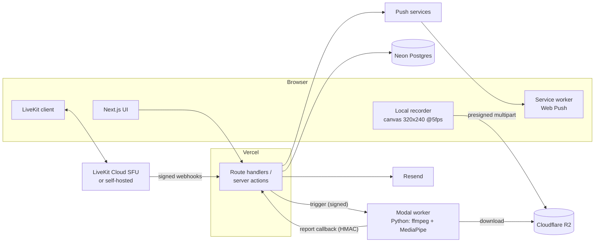

# Technology and Engineering Standards

This file fixes the stack, the hard rules, the environment variables, and the quality bars for Scholarly. Kiro designs and tasks must follow it. Budget: INR 500/month (about USD 6), so the target is USD 0/month on free tiers.

## Stack

| Layer | Choice | Why |
|---|---|---|
| Web framework | Next.js (App Router, TypeScript `strict`) | One codebase for UI and API; server components keep bundles small; first-class on Vercel. |
| Styling / components | Tailwind CSS + shadcn/ui themed with pastel design tokens | Fast to build, fully customizable, accessible primitives. |
| Hosting (web) | Vercel Hobby | Free for personal projects; preview deployments; Fluid compute functions. |
| Database | Neon Postgres + Drizzle ORM (migrations checked in) | Free tier with 0.5 GB and autoscaling to zero; projects are not paused; Drizzle keeps SQL explicit and typed. |
| Auth | Better Auth (Google social provider, email + password, `username` plugin), cookie sessions | Free, self-hosted in the app, supports the three required identifiers, built-in rate limiting. |
| Video (SFU) | LiveKit: `livekit-server-sdk` (tokens, webhooks, RoomService) and `@livekit/components-react` (UI) | Free Cloud tier to start; open-source server means self-hosting is a config change, not a rewrite. |
| Object storage | Cloudflare R2 via the S3 API (`@aws-sdk/client-s3`, presigned multipart URLs) | 10 GB free, free egress, free deletes; used only as transit storage for Phase 2 recordings. |
| Email | Resend + React Email templates | 100 emails/day free; typed templates. |
| Push | Web Push with VAPID (`web-push`), a service worker, and a web manifest | Free, standard, works on desktop, Android, and installed iOS web apps. |
| Analysis worker | Python 3.11 on Modal: ffmpeg, mediapipe, numpy, webrtcvad, boto3, httpx | USD 30/month free compute; serverless batch jobs; scheduled functions for the 5-minute Scheduler trigger. |
| Validation | Zod at every boundary; typed env schema validated at boot | Fail fast on bad input and bad config. |
| Testing | Vitest + Testing Library, API integration tests against a test Postgres, Playwright e2e (LiveKit mocked), pytest for the worker | Covers domain logic, routes, flows, and the analysis pipeline. |
| CI | GitHub Actions: lint, typecheck, unit, api, build (worker: pytest) | Must finish in under 10 minutes to fit 2,000 free minutes/month if the repo is private. |

## Verified free-tier limits (checked during planning)

| Service | Free tier | Design consequence |
|---|---|---|
| Vercel Hobby | Functions up to 300 s and 2 GB memory; request/response body limit 4.5 MB; cron jobs once per day only, precision ±59 min | Uploads go browser → R2 directly via presigned URLs. Sub-daily scheduling never uses Vercel cron. |
| Neon Free | 0.5 GB storage per project, 100 compute-hours/month, autoscale to zero, no project pausing | Keep rollup tables small; retention on notifications. |
| Cloudflare R2 Free | 10 GB-month storage, 1M Class A ops, 10M Class B ops, free egress; `DeleteObject` and `AbortMultipartUpload` are free | Recordings are transit-only and deleted after analysis; lifecycle rule of 2 days as a backstop. |
| Resend Free | 100 emails/day | Prioritize auth emails and "starting soon" when near the limit. |
| Modal Starter | USD 0 plan, USD 30/month free compute, CPU about USD 0.14 per core-hour, scheduled and web functions | Analyzing a 2-hour recording costs about USD 0.05; caps keep monthly analysis under the credit. |
| LiveKit Cloud Build | 5,000 WebRTC participant-minutes/month, 100 concurrent participants, 50 GB downstream, 60 egress minutes; hard cap, requests fail instead of billing | Never use Egress. If minutes run out: self-host LiveKit on an Oracle Cloud always-free VM (same SDK, new `LIVEKIT_URL`). |
| LiveKit webhooks | `room_started`, `room_finished`, `participant_joined`, `participant_left`, `participant_connection_aborted`, `track_published`, `track_unpublished`; no mute/unmute events; signed JWT in `Authorization`; content type `application/webhook+json`; retried but not guaranteed | Webhooks are ground truth for presence. Camera-on time uses client-reported state + heartbeats clipped to the webhook presence window. Handlers are idempotent by event id. |
| Google OAuth | Sign-in scopes (`openid email profile`) need no verification; consent screen requires a public privacy policy URL; Calendar scopes are sensitive and need verification (or up to 100 listed test users) | Static `/privacy` and `/terms` pages are required. Calendar API sync is deferred. |
| Web Push on iOS | Only for web apps installed to the Home Screen (iOS 16.4+) | Ship manifest + service worker; explain the limitation in settings. |

Rejected alternatives: Daily (10,000 free minutes but no self-host path and cloud recording at USD 0.01349/min), Amazon Chime SDK (no free tier), SMS OTP login (per-message cost, DLT registration in India), real-time in-browser analysis (user chose record-then-analyze), full Google Calendar API sync now (verification burden), provider-side recording (cost and privacy).

## Hard rules

1. Never route file uploads or any request body larger than 4 MB through Vercel functions. Use presigned R2 multipart URLs from the browser.
2. Never use Vercel cron for anything more frequent than daily. Time-based work runs through the Scheduler pattern: an idempotent `POST /api/cron/dispatch` protected by `CRON_SECRET`, triggered every 5 minutes by a Modal scheduled function (cron-job.org is the documented alternative).
3. Never use LiveKit Egress or any provider-side recording. Phase 2 records only the local user's own tracks in the browser.
4. LiveKit is accessed only through `LIVEKIT_URL`, `LIVEKIT_API_KEY`, and `LIVEKIT_API_SECRET`. No Cloud-only APIs. Self-hosting must be a configuration change.
5. Every inbound webhook and worker callback is verified (LiveKit JWT signature; HMAC-SHA256 over timestamp + body with a 5-minute window for the Worker) and processed idempotently by event id or (recording id, attempt).
6. Zod validation at every boundary: route handlers, server actions, webhook payloads, worker callbacks, environment variables. The app refuses to start with an invalid environment.
7. Server components by default. Client components only where interactivity requires them. The LiveKit client bundle loads only on the room route.
8. Drizzle migrations are generated and checked in. No manual schema drift.
9. Conventional Commits for every commit (`feat`, `fix`, `docs`, `refactor`, `test`, `chore`, `ci`, `perf`, `style`), imperative subject under 50 characters, body wrapped at 72.
10. No personal data or tokens in logs. Log user ids, never emails or names; never log presigned URLs, room tokens, or webhook bodies.
11. Inclusive terminology only: allowlist/denylist, main, primary/replica.

## Environment variables

| Variable | Purpose | Default |
|---|---|---|
| `DATABASE_URL` | Neon Postgres connection string (pooled) | required |
| `BETTER_AUTH_SECRET` | Better Auth signing secret | required |
| `BETTER_AUTH_URL` | Public base URL for auth callbacks | required |
| `GOOGLE_CLIENT_ID`, `GOOGLE_CLIENT_SECRET` | Google OAuth | required |
| `LIVEKIT_URL`, `LIVEKIT_API_KEY`, `LIVEKIT_API_SECRET` | LiveKit server (Cloud or self-hosted) | required |
| `R2_ACCOUNT_ID`, `R2_ACCESS_KEY_ID`, `R2_SECRET_ACCESS_KEY`, `R2_BUCKET` | Cloudflare R2 (Phase 2) | required in Phase 2 |
| `RESEND_API_KEY`, `EMAIL_FROM` | Transactional email | required |
| `VAPID_PUBLIC_KEY`, `VAPID_PRIVATE_KEY`, `VAPID_SUBJECT` | Web Push | required |
| `CRON_SECRET` | Bearer secret for `/api/cron/dispatch` | required |
| `WORKER_TRIGGER_URL`, `WORKER_SHARED_SECRET` | Modal worker endpoint and HMAC secret (Phase 2) | required in Phase 2 |
| `ADMIN_EMAILS` | Comma-separated admin emails | empty |
| `REGISTRATION_OPEN` | `true`/`false`; closes sign-up when false | `true` |
| `MONTHLY_MINUTES_PER_USER` | Video participant-minutes cap per user per month | `1500` |
| `MONTHLY_MINUTES_GLOBAL` | Video participant-minutes cap for everyone per month | `4500` |
| `ANALYSIS_HOURS_PER_USER` | Analysis hours cap per user per month (Phase 2) | `60` |
| `ANALYSIS_HOURS_GLOBAL` | Analysis hours cap for everyone per month (Phase 2) | `400` |
| `NEXT_PUBLIC_APP_URL` | Public app URL used in links | required |

`web/.env.example` lists every variable with a placeholder and no real values. Secrets live only in Vercel and Modal environment settings.

## Coding standards

- TypeScript `strict`, no `any`, explicit return types on exported functions.
- ESLint (Next.js config + `@typescript-eslint`) and Prettier; both run in CI.
- Domain logic (study-time aggregation, streaks, joinability, cap checks, ICS generation, report metrics) lives in pure functions under `web/lib/domain` with unit tests. Route handlers are thin.
- Every route handler and server action validates input with Zod and checks authorization (host vs participant vs admin) before touching data.
- Database access only through Drizzle; migrations in `web/lib/db/migrations`.
- Dates are stored in UTC (`timestamptz`); user-facing dates are rendered and aggregated in the user's IANA timezone.
- Worker code (Python) uses type hints, `ruff` for lint and format, and pure functions for metric derivation with pytest coverage.

## Testing standards

- Unit tests for all domain calculations, including midnight splits, DST transitions, timezone changes, overlapping intervals, streaks, joinability windows, cap arithmetic, ICS output, and analysis metric derivation.
- API integration tests for every route handler, run against a test Postgres (Neon branch or local Postgres in CI).
- Playwright e2e for sign-up, sign-in, password reset, create session, invite, accept, join (LiveKit mocked), dashboard rendering, and notification preferences.
- Worker: pytest with synthetic fixtures (frames with and without a face, a phone image, speech and silence audio) and a golden report that must match byte-for-byte after normalization.
- CI (lint, typecheck, unit, api, build, pytest) must complete in under 10 minutes.

## Performance budgets

- Core Web Vitals on a mid-range laptop over a 4G profile: LCP ≤ 2.5 s, INP ≤ 200 ms, CLS ≤ 0.1.
- ≤ 200 KB gzipped JavaScript on every route except the room route.
- LiveKit client loaded lazily on the room route only; time from "Join" to first remote video ≤ 3 s on a good network.
- Dashboard and calendar data queries p95 < 1 s from a warm database.
- Skeleton loaders for every data view; optimistic updates for invites, settings, and notification read state.
- Images through `next/image`; one variable font via `next/font`.

## Accessibility

- WCAG 2.1 AA. Every interactive element keyboard reachable with a visible focus ring.
- Text contrast ≥ 4.5:1: dark ink on pastel surfaces, never pastel-on-pastel text.
- `prefers-reduced-motion` respected; transitions 150–250 ms.
- Live regions (`aria-live="polite"`) for new notifications and room events; charts have a data-table fallback.

## Security

- Cookies: `HttpOnly`, `Secure`, `SameSite=Lax`. CSRF protection on all mutating requests.
- Passwords hashed with Better Auth's default (scrypt). Minimum 10 characters, checked against a common-password denylist.
- Rate limits on sign-in, password reset, and verification resend: 5 attempts per 15 minutes per IP + identifier. Responses never reveal whether an account exists.
- LiveKit room tokens: TTL 1 hour, scoped to one room, identity = user id; host tokens carry room admin grants.
- Presigned R2 URLs: TTL 15 minutes, one object key, one part each.
- Security headers: CSP, HSTS, `X-Content-Type-Options`, `Referrer-Policy`, `Permissions-Policy` (camera and microphone allowed for self only).
- `npm audit` / `pip-audit` in CI at high severity.
- Secrets only in environment variables; never in the repo, logs, or client bundles (only `NEXT_PUBLIC_*` reaches the browser).

## Privacy

- Self-service deletion of the account, individual focus reports, and any media, each completing within 60 seconds.
- Recording consent copy states exactly what is captured, where it is stored, for how long, and that other participants are never recorded.
- Media retention: deleted within 60 seconds of report storage; Scheduler sweep at 48 hours; R2 lifecycle rule at 2 days.

## Observability

- Structured JSON logs with request id, user id, route, and duration.
- `GET /api/health` returns 200 with a database connectivity check.
- Optional Sentry free tier for error tracking; off by default.

## Design tokens

Single light theme. Pastel surfaces with dark ink text.

| Token | Value | Use |
|---|---|---|
| `--lavender` | `#E6E0F8` | Primary surface, session cards |
| `--mint` | `#D9F2E6` | Success, "live now" |
| `--peach` | `#FFE5D4` | Warnings, streak |
| `--sky` | `#DCEEFB` | Info, calendar |
| `--butter` | `#FFF3C4` | Highlights, target |
| `--blush` | `#FADDE1` | Danger (soft), destructive confirm |
| `--ink` | `#1F2933` | Text |
| `--ink-muted` | `#52606D` | Secondary text |
| `--paper` | `#FBFAF7` | Page background (warm neutral) |
| `--line` | `#E4E7EB` | Borders |

Spacing on an 8-pt grid, `rounded-xl` corners, soft shadows (`0 4px 16px rgba(31,41,51,0.06)`), one variable font (Inter or equivalent) loaded via `next/font`.

## Architecture

