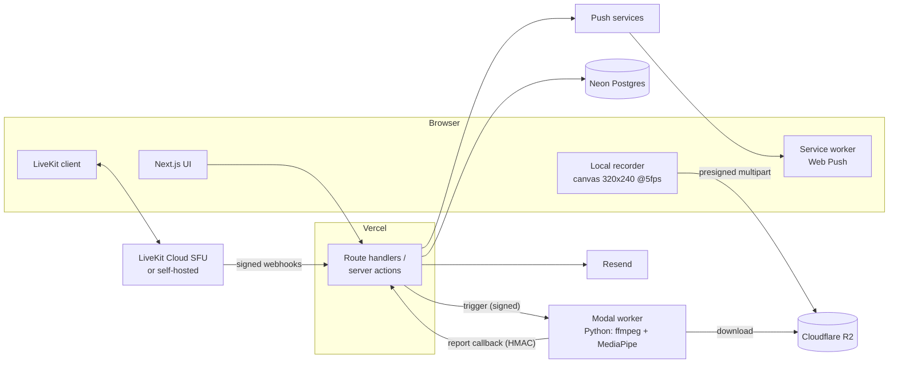
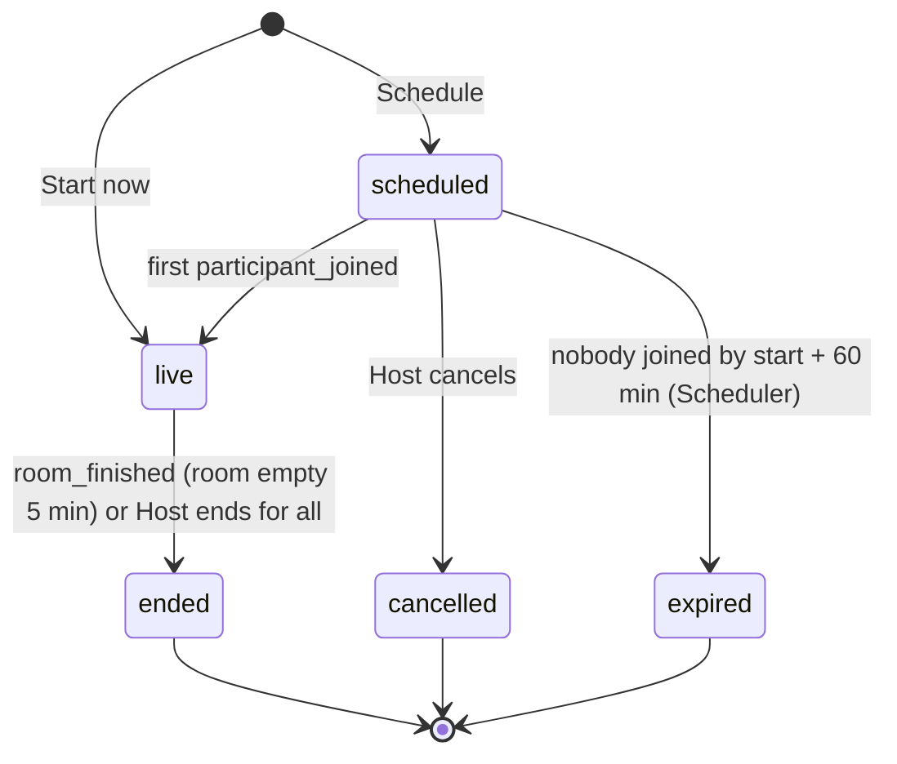

# Scholarly - Consolidated Requirements

This is the source of truth for Scholarly. The six Kiro specs under `.kiro/specs/` are extracted from sections 5 and 6 of this document and carry the same requirement IDs (`F<feature>-R<n>`). If a spec and this document ever disagree, fix both; this document wins.

Conventions: acceptance criteria use EARS patterns (`WHEN … THEN THE <Component> SHALL …`, `IF … THEN THE <Component> SHALL …`, `WHILE … THE <Component> SHALL …`, `THE <Component> SHALL …`). Components: **Web App** (browser UI, including its service worker), **API** (Next.js server: route handlers and server actions), **Worker** (Modal Python analysis app), **Scheduler** (the jobs run by `POST /api/cron/dispatch`), **Database** (Neon Postgres), **Storage** (Cloudflare R2), **SFU** (LiveKit server), **CI Pipeline** (GitHub Actions), **Repository** (this git repository). Roles: **Visitor** (signed out), **Student** (signed in), **Host**, **Invitee**, **Admin**.

---

## 1. Vision and personas

**Vision.** Studying alone for hours is isolating and easy to abandon. Scholarly lets a small group of friends start or schedule private video study sessions and sit together with cameras on. Presence creates accountability. The app records how much camera-on study time each person put in against a daily target, shows history and a calendar, sends reminders, and in Phase 2 turns a user's own low-resolution recording into a private focus report, then deletes the recording.

**Personas.**

| Persona | Description | Primary needs |
|---|---|---|
| Student | Any signed-in user (about 10 people, the owner and friends). | Start or join a session quickly, see today's progress, keep a streak. |
| Host | A Student who created a session. | Invite friends by name or link, control the room, reschedule or cancel. |
| Invitee | A Student invited to a session. | Accept or decline, get reminded, join in one click. |
| Admin | The owner (email in `ADMIN_EMAILS`). | See usage against free-tier caps, close registration if needed. |
| Visitor | Not signed in. | Sign in with Google or create an account; read privacy and terms. |

---

## 2. Decision log

| Decision | Chosen | Alternatives rejected | Why |
|---|---|---|---|
| Scale and budget | ~10 users, USD 0/month target, hard ceiling INR 500/month | Paid plans | Personal project for friends. |
| Web stack | Next.js App Router + TypeScript + Tailwind + shadcn/ui on Vercel Hobby | Separate SPA + API; other frameworks | One codebase, server components, free hosting, small bundles. |
| Database | Neon Postgres + Drizzle | Supabase (free tier pauses projects after inactivity) | No pausing, autoscale to zero, explicit SQL. |
| Auth | Better Auth: Google + email/username + password | Supabase Auth, Auth.js, Clerk, phone/SMS OTP | Supports all three identifiers, free, in-app. SMS costs per message and needs DLT registration in India. |
| Video | LiveKit (Cloud free tier, self-host fallback) | Daily (10,000 free min, no self-host path, expensive recording), Amazon Chime SDK (no free tier), P2P WebRTC (quality drops past 4 people) | 5,000 free minutes with a hard cap, open-source server, same SDK when self-hosted. |
| Recording | Local, own tracks only, low resolution, browser upload to R2 | LiveKit Egress, Daily cloud recording | Provider recording costs about USD 1.60 per 2-hour session per user and records other people. |
| Analysis execution | Offline on a Modal Python worker after upload, media deleted after report | Real-time in-browser analysis (no upload) | User preference: record, upload, analyze, then delete permanently. |
| Analysis models | MediaPipe Face Landmarker, MediaPipe Object Detector (EfficientDet-Lite0), webrtcvad, RMS | Cloud vision APIs, LLM video models | CPU-only, free, deterministic, fits Modal's free credit. |
| Scheduling | Modal scheduled function every 5 min calling `/api/cron/dispatch` | Vercel cron (once per day on Hobby), Upstash QStash | Hobby cron is daily-only with ±59 min precision. |
| Object storage | Cloudflare R2 | S3 (free tier expires), Supabase Storage (1 GB) | 10 GB free, free egress, free deletes. |
| Email | Resend | SES, Postmark | 100/day free, typed templates. |
| Push | Web Push (VAPID) + manifest + service worker | Native apps, FCM | Free and standard; iOS needs Home Screen install. |
| Calendar | In-app calendar + Google template link + `.ics` + personal iCal feed | Google Calendar API sync now | Calendar scopes need Google verification for open sign-up; deferred, data model ready. |
| Sign-up | Open, with caps and `REGISTRATION_OPEN` flag | Invite-only allowlist | User preference; guardrails protect free tiers. |
| Study time | Camera-on time only | Any time in session; solo timer | User preference. |
| Targets | Daily hours target | Weekly | User preference. |
| Devices | Desktop-first, mobile-friendly, installable | Desktop only; full PWA with offline | Phones must join and view; offline adds no value. |

---

## 3. Assumptions

Change any of these by editing this document and the matching spec.

- Product name "Scholarly". Single light pastel theme; no dark mode in Phase 1.
- Session duration 15 minutes to 12 hours (default 60 minutes). Scheduled start at least 5 minutes and at most 365 days ahead.
- Recording cap per user per session: 6 hours or 1 GB. Deep-work block default 25 minutes (10–90 configurable).
- Default caps: 1,500 video participant-minutes per user per month, 4,500 global; analysis 60 hours per user per month, 400 global.
- Username changes allowed with uniqueness enforced, no cooldown. Avatar is the Google picture or initials; no upload.
- Repository visibility unknown; CI stays under 10 minutes per run to fit GitHub's 2,000 free minutes/month if private.
- Times are stored in UTC and shown in the user's IANA timezone. Weeks start on Monday.

---

## 4. Architecture

### 4.1 Key flows

**Join a session.** Student opens the session page → Web App asks API for a room token → API checks role (host or accepted invitee), joinability window, capacity, and monthly caps → API creates the SFU room if needed (`emptyTimeout` 300 s, `maxParticipants` 10) and returns a 1-hour token → Web App connects to the SFU → SFU sends `participant_joined` webhook → API opens a participation → Web App starts posting camera state changes and 60-second heartbeats → API records camera reports and derives camera intervals clipped to the participation → on leave, SFU sends `participant_left` → API closes the participation and interval, updates `daily_totals`.

**Session ends.** Last participant leaves → SFU waits 300 s → `room_finished` → API sets `ended`. Or Host selects "End for all" → API deletes the room → everyone is disconnected → API sets `ended` immediately.

**Reminder dispatch.** Every 5 minutes the Modal scheduled function calls `POST /api/cron/dispatch` with `CRON_SECRET` → Scheduler sends due `session_starting_soon` (dedupe via `notification_dispatch`), expires stale scheduled sessions, closes stale camera intervals, ends sessions missing `room_finished`, re-triggers stuck analyses, deletes overdue media, prunes old notifications, and once per day reconciles `daily_totals`.

**Recording upload (Phase 2).** Web App draws own camera to a 320×240 canvas at 5 fps → `MediaRecorder` emits 60-second chunks → chunks go to IndexedDB → when 5 MB accumulate, Web App asks API for a presigned part URL → uploads directly to R2 → on session end, Web App completes the multipart upload → API marks `uploaded` and triggers the Worker.

**Analysis (Phase 2).** Worker downloads the object → extracts 1 fps frames and 16 kHz audio → runs face landmarks, object detection, VAD, RMS → derives states, episodes, metrics, timeline → posts the HMAC-signed report to `/api/internal/analysis/callback` → API stores the report, deletes the R2 object within 60 s, emits `analysis_ready`.

### 4.2 Session state machine

---

## 5. Functional requirements

### F1 - Foundation and authentication (spec `01-foundation-auth`)

#### F1-R1 Project scaffold and CI
**User Story:** As the owner, I want a production-grade project skeleton with CI, so that every later feature is built on a consistent, tested foundation.
1. THE Web App SHALL be a Next.js App Router project in `web/` written in TypeScript with `strict` enabled, using Tailwind CSS and shadcn/ui.
2. THE API SHALL access the Database only through Drizzle ORM, with migrations checked into `web/lib/db/migrations`.
3. WHEN the application starts with a missing or malformed required environment variable THEN THE API SHALL refuse to start and log the names (never the values) of the invalid variables.
4. WHEN `GET /api/health` is requested THEN THE API SHALL respond within 2 s with HTTP 200 and `{ "status": "ok", "db": "ok" }`, or HTTP 503 when the Database is unreachable.
5. THE CI Pipeline SHALL run lint, typecheck, unit tests, API tests, and a production build on every push and pull request.
6. THE CI Pipeline SHALL complete in under 10 minutes on GitHub-hosted runners.
7. THE Repository SHALL contain `web/.env.example` listing every environment variable from `tech.md` with placeholder values and no secrets.
8. THE Web App SHALL provide single npm scripts for lint, typecheck, unit tests (Vitest), API tests, e2e tests (Playwright), and build.

#### F1-R2 Design system and app shell
**User Story:** As a Student, I want a calm, fast, consistent interface on desktop and phone, so that using the app feels effortless.
1. THE Web App SHALL define the pastel design tokens from `tech.md` as CSS custom properties and map them into the Tailwind and shadcn/ui theme.
2. THE Web App SHALL render all text with a contrast ratio of at least 4.5:1 against its background.
3. WHILE the viewport is at least 1024 px wide THE Web App SHALL show a top navigation with Home, Sessions, Calendar, a notification bell, and a profile menu.
4. WHILE the viewport is narrower than 1024 px THE Web App SHALL show a bottom navigation with Home, Sessions, Calendar, and Profile, and keep the notification bell in the header.
5. WHEN a view is loading data THEN THE Web App SHALL display skeleton placeholders matching the final layout instead of spinners or blank areas.
6. IF the system preference `prefers-reduced-motion: reduce` is set THEN THE Web App SHALL disable non-essential transitions and animations.
7. THE Web App SHALL keep transition durations between 150 ms and 250 ms.
8. THE Web App SHALL show a visible focus indicator on every interactive element during keyboard navigation.
9. WHEN a list or view has no data THEN THE Web App SHALL show an empty state with a one-sentence explanation and that view's primary action.
10. THE Web App SHALL ship at most 200 KB of gzipped JavaScript on every route except the session room route.

#### F1-R3 Sign in with Google
**User Story:** As a Visitor, I want to sign in with my Google account, so that I can start without creating another password.
1. WHEN a Visitor selects "Continue with Google" THEN THE API SHALL start an OAuth 2.0 authorization-code flow requesting only the `openid`, `email`, and `profile` scopes.
2. WHEN Google returns a verified email that matches no existing account THEN THE API SHALL create an account with the Google name as display name, the Google picture as avatar, and a unique username derived from the email local part (lowercased, restricted to `[a-z0-9_]`, truncated to 20 characters, numeric suffix appended on collision).
3. WHEN Google returns a verified email that matches an existing account THEN THE API SHALL link the Google identity to that account and sign the user in.
4. IF Google reports the email as unverified THEN THE API SHALL reject the sign-in with "Your Google email address is not verified" and create no account.
5. IF the OAuth flow fails or is cancelled THEN THE Web App SHALL return the Visitor to the sign-in page with a non-technical message and no partial account.
6. WHEN sign-in completes THEN THE Web App SHALL redirect to the page originally requested, or to Home when none was requested.

#### F1-R4 Email or username with password
**User Story:** As a Visitor, I want to create an account with email, a username, and a password, so that I can use Scholarly without Google.
1. WHEN a Visitor submits the sign-up form THEN THE API SHALL require an email address, a username, a display name, and a password.
2. THE API SHALL accept a username only if it is 3 to 20 characters long, contains only `[a-z0-9_]` after lowercasing, and is unique case-insensitively.
3. THE API SHALL accept a password only if it is at least 10 characters long and absent from a bundled common-password denylist of at least 10,000 entries.
4. IF the username is already taken THEN THE API SHALL reject the sign-up with "That username is taken".
5. IF the email already belongs to an account THEN THE API SHALL respond exactly as for a successful sign-up, send that address an email explaining an account already exists, and create no duplicate.
6. WHEN sign-up succeeds THEN THE API SHALL create the account, start a session, and send the verification email (F1-R5).
7. WHEN a Visitor submits the sign-in form THEN THE API SHALL accept either an email address or a username in the identifier field together with the password.
8. IF sign-in credentials are invalid THEN THE API SHALL respond with "Incorrect email/username or password" regardless of whether the identifier exists.
9. THE API SHALL hash passwords with Better Auth's default scrypt configuration and never store or log plaintext passwords.

#### F1-R5 Email verification
**User Story:** As a Student, I want to verify my email address, so that Scholarly can safely send me notifications.
1. WHEN an account is created with email and password THEN THE API SHALL send a verification email containing a single-use link valid for 24 hours.
2. WHEN a valid verification link is opened THEN THE API SHALL mark the email verified and show a confirmation page linking to Home.
3. IF a verification link is expired or already used THEN THE Web App SHALL show an explanation with a "Send a new link" action.
4. WHEN a new verification email is requested THEN THE API SHALL send it only if at least 60 s have passed since the previous one for that account.
5. WHILE the account email is unverified THE Web App SHALL show a dismissible banner on every app page with a "Resend" action, reappearing at the next sign-in.
6. WHILE the account email is unverified THE API SHALL suppress every email notification except verification and password-reset emails.
7. THE API SHALL treat emails obtained from Google sign-in as verified.

#### F1-R6 Password reset and change
**User Story:** As a Student, I want to reset a forgotten password and change my current one, so that I keep control of my account.
1. WHEN a Visitor submits the "Forgot password" form THEN THE API SHALL respond with "If an account exists for that email, we sent a reset link" regardless of whether the account exists.
2. IF the email belongs to an account THEN THE API SHALL send a single-use reset link valid for 1 hour.
3. WHEN a valid reset link is used with a password meeting F1-R4 rules THEN THE API SHALL update the password, invalidate every existing session of the account, and sign the user in on the current device.
4. IF a reset link is expired or already used THEN THE Web App SHALL show an explanation and a link to request a new one.
5. WHEN a signed-in Student changes their password THEN THE API SHALL require the current password and, on success, invalidate every session except the current one.
6. IF the account has no password (Google only) THEN THE Web App SHALL offer "Set a password" through the reset-email flow instead of asking for a current password.

#### F1-R7 Rate limiting and anti-enumeration
**User Story:** As the owner, I want authentication endpoints protected against guessing and probing, so that accounts stay safe on a public sign-up app.
1. THE API SHALL limit sign-in, password-reset request, and verification-resend attempts to 5 per 15 minutes per combination of client IP and identifier.
2. WHEN a limit is exceeded THEN THE API SHALL respond with HTTP 429, a `Retry-After` header, and "Too many attempts. Try again in N minutes".
3. THE API SHALL return identical status codes and messages for existing and non-existing identifiers on sign-in and reset endpoints, with response times differing by no more than 100 ms.
4. THE API SHALL limit account creation to 10 per hour per client IP.

#### F1-R8 Profile and settings
**User Story:** As a Student, I want to manage my display name, username, avatar, and timezone, so that others recognize me and my times are shown correctly.
1. THE Web App SHALL provide Settings › Profile showing display name, username, avatar, email (read-only), and timezone.
2. WHEN a Student saves a display name THEN THE API SHALL accept 1 to 50 characters after trimming whitespace.
3. WHEN a Student saves a new username THEN THE API SHALL apply the F1-R4 username rules and reject it if taken.
4. THE Web App SHALL show the Google profile picture as avatar when available, otherwise the initials of the display name on a pastel background derived from the user id.
5. WHEN a Student signs in for the first time THEN THE Web App SHALL detect the browser's IANA timezone and store it as the profile timezone.
6. WHEN a Student edits the timezone THEN THE Web App SHALL offer the full IANA timezone list with search and save the selection.
7. IF the browser timezone differs from the stored timezone at sign-in THEN THE Web App SHALL show a one-time prompt offering to switch.
8. THE Web App SHALL structure Settings as sections (Profile, Study target, Notifications, Calendar, Focus analysis, Account) so later specs add sections without restructuring.

#### F1-R9 Sessions and sign-out
**User Story:** As a Student, I want to stay signed in on my devices and be able to sign out everywhere, so that access is convenient and controllable.
1. THE API SHALL issue the session cookie with `HttpOnly`, `Secure`, and `SameSite=Lax`.
2. THE API SHALL expire an auth session 30 days after its last use and extend the expiry on each request made at least 24 hours after the previous extension.
3. WHEN a Student selects "Sign out" THEN THE API SHALL invalidate the current auth session and redirect to sign-in.
4. WHEN a Student selects "Sign out everywhere" THEN THE API SHALL invalidate all auth sessions of the account including the current one.
5. WHEN a Visitor requests an authenticated route THEN THE Web App SHALL redirect to sign-in and return them to that route after successful sign-in.

#### F1-R10 Registration flag and admin
**User Story:** As the owner, I want to close sign-up and see usage at a glance, so that free tiers are protected.
1. WHILE `REGISTRATION_OPEN` is `false` THE API SHALL reject new sign-ups (email and Google) with "Scholarly is not accepting new accounts right now" and continue to sign in existing accounts.
2. WHILE `REGISTRATION_OPEN` is `false` THE Web App SHALL hide sign-up entry points and show the closed message on the sign-up page.
3. WHEN a Student whose email is listed in `ADMIN_EMAILS` opens the profile menu THEN THE Web App SHALL show an "Admin" entry.
4. THE Web App SHALL show on the Admin page the total user count, accounts created in the last 30 days, and the current month's usage counters against caps (video participant-minutes per user and global; analysis hours in Phase 2).
5. IF a non-admin requests the Admin page or its API THEN THE API SHALL respond with HTTP 404.

#### F1-R11 Account deletion
**User Story:** As a Student, I want to delete my account and data, so that I stay in control of my information.
1. WHEN a Student selects "Delete account" THEN THE Web App SHALL require typing their username before enabling the confirm button.
2. WHEN deletion is confirmed THEN THE API SHALL delete the user's profile, settings, auth sessions, invites, participations, camera reports and intervals, daily totals, notifications, push subscriptions, calendar tokens, recording metadata, and reports within 60 s.
3. WHEN deletion is confirmed THEN THE API SHALL cancel every `scheduled` session the user hosts, end any `live` session they host, and retain those session records with the host reference removed so other participants' history remains intact.
4. WHEN deletion cancels a scheduled session THEN THE API SHALL emit `session_cancelled` for each pending or accepted Invitee.
5. IF Phase 2 media exists for the user THEN THE API SHALL delete the Storage objects as part of the deletion.
6. WHEN deletion completes THEN THE API SHALL sign the user out and show a confirmation page.

#### F1-R12 Legal pages
**User Story:** As a Visitor, I want to read what data Scholarly handles, so that I can decide to use it (and Google's consent screen requires it).
1. THE Web App SHALL serve static `/privacy` and `/terms` pages accessible without sign-in.
2. THE Web App SHALL describe on `/privacy` the data collected (account, session participation, camera-on time), the third-party services used (Google sign-in, LiveKit, Neon, Vercel, Resend, Cloudflare R2, Modal), the Phase 2 recording behavior including deletion timelines, and how to delete an account.
3. THE Web App SHALL link `/privacy` and `/terms` from the sign-up page and the page footer.

---

### F2 - Study sessions (spec `02-study-sessions`)

#### F2-R1 Create an instant session
**User Story:** As a Student, I want to start a study session right now, so that friends can join me immediately.
1. WHEN a Student selects "Start now" THEN THE Web App SHALL show a form with a title (default "Study session", 1–80 characters) and an optional description (up to 500 characters).
2. WHEN the form is submitted THEN THE API SHALL create a session with `kind = instant`, `status = live`, `started_at = now`, `livekit_room_name = session-<id>`, and the creator as Host.
3. WHEN creation succeeds THEN THE Web App SHALL show the pre-join screen (F2-R9) within 1 s.
4. IF the Host already has another `live` session THEN THE API SHALL refuse creation with "End your current live session first".

#### F2-R2 Create a scheduled session
**User Story:** As a Student, I want to schedule a study session for later, so that friends can plan to join.
1. WHEN a Student selects "Schedule" THEN THE Web App SHALL show a form with title (default "Study session", 1–80 characters), optional description (up to 500 characters), start date and time in the Student's timezone, and duration.
2. THE API SHALL accept a start time only if it is at least 5 minutes in the future and at most 365 days ahead.
3. THE API SHALL accept a duration between 15 minutes and 12 hours in 15-minute steps, defaulting to 60 minutes.
4. WHEN the form is submitted THEN THE API SHALL create a session with `kind = scheduled`, `status = scheduled`, `scheduled_start`, `scheduled_end = scheduled_start + duration`, `version = 1`, and the creator as Host, without creating the SFU room yet.
5. WHEN creation succeeds THEN THE Web App SHALL show the session detail page with invite controls.

#### F2-R3 Edit, reschedule, cancel
**User Story:** As a Host, I want to change or cancel a scheduled session, so that plans can adapt.
1. WHILE a session is `scheduled` THE API SHALL allow only the Host to edit title, description, start time, and duration.
2. WHEN the start time or duration of a `scheduled` session changes THEN THE API SHALL increment `version` and emit `session_rescheduled` to every pending and accepted Invitee.
3. WHEN the Host cancels a `scheduled` session THEN THE API SHALL set `status = cancelled`, disable the invite link, and emit `session_cancelled` to every pending and accepted Invitee.
4. WHILE a session is `live` THE API SHALL reject edits and cancellation with "Live sessions can only be ended".
5. WHILE a session is `ended`, `cancelled`, or `expired` THE API SHALL reject every modification.
6. IF a non-host attempts any of these operations THEN THE API SHALL respond with HTTP 403.

#### F2-R4 Lifecycle and expiry
**User Story:** As a Student, I want sessions to move through clear states automatically, so that lists and stats are always accurate.
1. THE API SHALL implement the session state machine shown in the state diagram: `scheduled → live`, `live → ended`, `scheduled → cancelled`, `scheduled → expired`; instant sessions start in `live`.
2. WHEN the first `participant_joined` webhook for a `scheduled` session is processed THEN THE API SHALL set `status = live` and `started_at` to the event timestamp.
3. WHEN a `room_finished` webhook is processed for a `live` session THEN THE API SHALL set `status = ended`, set `ended_at` to the event timestamp, and close every open participation and camera interval of that session at that time.
4. WHEN the Host selects "End for all" THEN THE API SHALL delete the room on the SFU, set `status = ended` and `ended_at = now` immediately, and ignore the later `room_finished` for that room.
5. WHEN the Scheduler runs THEN THE Scheduler SHALL set `status = expired` on every `scheduled` session whose `scheduled_start` is more than 60 minutes in the past and that has no participations.
6. THE API SHALL create the SFU room with `emptyTimeout = 300` seconds and `maxParticipants = 10` before issuing the first token for a session.
7. IF a `live` session has had no connected participants for 30 minutes and no `room_finished` was received THEN THE Scheduler SHALL query the SFU and set `status = ended` when the room no longer exists.

#### F2-R5 Invite by identity
**User Story:** As a Host, I want to invite specific friends by username or email, so that only they can join.
1. WHEN the Host enters an exact username or exact email address in the invite field THEN THE API SHALL return the single matching registered Student (display name, username, avatar) or "No user found", never partial matches.
2. WHEN the Host confirms an invitee THEN THE API SHALL create an invite with `status = pending`, `via = identity`, and emit `invite_received` to that Student.
3. THE API SHALL allow at most 9 invites in `pending` or `accepted` status per session (10 participants including the Host).
4. IF the Host invites a Student who already has a `pending` or `accepted` invite THEN THE API SHALL respond with "Already invited" and change nothing.
5. WHEN an Invitee accepts THEN THE API SHALL set `status = accepted` and emit `invite_accepted` to the Host.
6. WHEN an Invitee declines THEN THE API SHALL set `status = declined` and emit `invite_declined` to the Host.
7. WHEN the Host revokes an invite THEN THE API SHALL set `status = revoked` and, if that user is connected to the room, remove them from the SFU room.
8. THE Web App SHALL show pending invites to the Invitee on Home and on the session detail page with Accept and Decline actions.
9. THE Web App SHALL show the Host every invitee with status and a Revoke action.
10. WHEN a Student with a `declined` or `revoked` invite is invited again THEN THE API SHALL reuse the invite row and reset it to `pending`.

#### F2-R6 Invite link
**User Story:** As a Host, I want to share a private link, so that friends can join without me typing their names.
1. WHEN the Host enables the invite link THEN THE API SHALL generate a token with at least 128 bits of cryptographic randomness, encoded URL-safe, and set `link_enabled = true`.
2. WHEN the Host disables the link THEN THE API SHALL set `link_enabled = false` so the URL stops working immediately while keeping the token for re-enabling.
3. WHEN the Host regenerates the link THEN THE API SHALL replace the token and invalidate the previous one immediately.
4. WHEN a signed-in Student opens `/join/<token>` for an enabled link of a `scheduled` or `live` session with invite capacity THEN THE API SHALL create or reactivate an invite with `status = accepted`, `via = link`, and send them to the pre-join screen, or to the session detail page when the session is not yet joinable.
5. WHEN a Visitor opens `/join/<token>` THEN THE Web App SHALL redirect to sign-in (with a sign-up option) and return them to the same link after authentication.
6. IF the token is unknown, the link is disabled, the session is `ended`, `cancelled`, or `expired`, or the invite cap is reached THEN THE Web App SHALL show an error page naming the reason (invalid link, link disabled, session over, session full) without exposing session details.
7. THE Web App SHALL provide a "Copy link" action that copies `NEXT_PUBLIC_APP_URL/join/<token>` and confirms with a toast.
8. THE API SHALL compare link tokens in constant time and never write them to logs.

#### F2-R7 Access control and room tokens
**User Story:** As a Host, I want only invited people to be able to enter my session, so that it stays private.
1. WHEN a Student requests to join a session THEN THE API SHALL issue an SFU token only if the Student is the Host or holds an `accepted` invite and the session is joinable (F2-R8).
2. THE API SHALL issue tokens with a 1-hour TTL scoped to the session's room only, `identity` = user id, `name` = display name, and `canPublish`, `canSubscribe`, and `canPublishData` grants; Host tokens additionally carry `roomAdmin`.
3. IF a token request is denied THEN THE API SHALL respond with HTTP 403, one reason code from `not_invited`, `not_open_yet`, `ended`, `cancelled`, `full`, `cap_reached`, and a human-readable message.
4. THE API SHALL never expose `LIVEKIT_API_SECRET` or issue a token for a user other than the requester.
5. WHEN the Web App needs to reconnect after a network interruption THEN THE Web App SHALL request a fresh token from the API instead of reusing an expired one.

#### F2-R8 Join rules
**User Story:** As an Invitee, I want to know exactly when I can join, so that I am never confused at the door.
1. THE API SHALL consider a session joinable when its status is `live`, or its status is `scheduled` and the current time is at or after `scheduled_start − 10 minutes`.
2. IF 10 participants are currently connected THEN THE API SHALL deny a further token with reason `full`.
3. IF the requester's or the global monthly participant-minute usage has reached its cap THEN THE API SHALL deny the token with reason `cap_reached` (F2-R13).
4. WHEN a session is not yet joinable THEN THE Web App SHALL show a countdown to the join window and enable the Join button automatically when the window opens, without a page reload.

#### F2-R9 Pre-join screen
**User Story:** As a Student, I want to check my camera and mic before entering, so that I join looking and sounding right.
1. WHEN a Student opens the pre-join screen THEN THE Web App SHALL request camera and microphone permissions and show a live camera preview.
2. THE Web App SHALL default the camera to on and the microphone to muted on the pre-join screen and on entering the room.
3. THE Web App SHALL let the user choose camera, microphone, and speaker devices and remember the choices in localStorage for the next session.
4. IF camera or microphone permission is denied THEN THE Web App SHALL show browser-specific guidance for enabling permissions and still allow joining with the denied device off.
5. WHEN the user selects "Join" THEN THE Web App SHALL request a token (F2-R7), connect to the SFU, and show the first remote video within 3 s on a good network.

#### F2-R10 In-room experience
**User Story:** As a Student, I want to see my friends studying in a clean, distraction-free room, so that I feel accompanied without being pulled away from my work.
1. WHILE connected THE Web App SHALL lay out participant tiles in an adaptive grid: 1 column for 1 participant, 2 columns for 2–4, 3 columns for 5–9, 4 columns for 10 on viewports 768 px and wider; 1–2 columns below 768 px.
2. THE Web App SHALL show on each tile the display name, a microphone-state icon, and, when the camera is off, a placeholder with the participant's initials on their avatar color.
3. THE Web App SHALL show the local user's video as a tile labelled "You".
4. THE Web App SHALL provide controls to toggle microphone, toggle camera, switch devices, and leave, each keyboard-operable with an accessible label.
5. THE Web App SHALL show the elapsed time since `started_at`, the participant count, and a per-participant connection-quality indicator.
6. WHILE the local user is the Host THE Web App SHALL show a "Remove" action on every other participant's tile and an "End for all" control with a confirmation step.
7. WHEN the Host removes a participant THEN THE API SHALL remove that participant from the SFU room.
8. WHEN a participant is removed by the Host THEN THE Web App SHALL show them "You were removed by the host" and return them to the session detail page.
9. WHEN the connection is interrupted THEN THE Web App SHALL show a "Reconnecting" state and resume automatically, requesting a new token if needed.
10. THE Web App SHALL load the LiveKit client bundle only on the room route.
11. THE Web App SHALL provide no text chat and no screen sharing in Phase 1.
12. WHEN the user leaves or closes the tab THEN THE Web App SHALL disconnect from the SFU explicitly so `participant_left` fires promptly.

#### F2-R11 Presence tracking via webhooks
**User Story:** As a Student, I want my presence in sessions recorded reliably, so that history and study time are trustworthy.
1. WHEN a request arrives at `POST /api/webhooks/livekit` THEN THE API SHALL verify the JWT signature in the `Authorization` header with the LiveKit API key and secret and reject unverifiable requests with HTTP 401.
2. WHEN a verified webhook event arrives THEN THE API SHALL store its event id in `webhook_events` and ignore any event whose id is already stored.
3. WHEN `participant_joined` is processed THEN THE API SHALL open a participation for the user identified by the participant identity with `joined_at` = event timestamp.
4. WHEN `participant_left` or `participant_connection_aborted` is processed THEN THE API SHALL close the matching open participation with `left_at` = event timestamp and close any open camera interval of that participation at the same time.
5. IF events arrive out of order THEN THE API SHALL derive the participation window from the event timestamps rather than the arrival order.
6. IF a webhook references a room that matches no session THEN THE API SHALL log a warning with the room name and respond with HTTP 200.
7. THE API SHALL respond to webhooks within 300 ms at p95 by deferring notifications and rollups until after the response is sent.

#### F2-R12 Camera-on tracking
**User Story:** As a Student, I want only my camera-on time to count as study time, so that the numbers reflect real accompanied study.
1. WHILE connected to a room THE Web App SHALL post a camera state report to the API within 2 s of the local camera being enabled or disabled (publish, unpublish, mute, or unmute).
2. WHILE connected to a room THE Web App SHALL post a heartbeat every 60 s containing `sessionId` and `cameraOn`.
3. THE API SHALL persist every camera report (user, session, `cameraOn`, timestamp) and derive camera intervals as the periods from a `cameraOn = true` report to the next `cameraOn = false` report of the same participation.
4. WHEN no heartbeat or state report has been received for 3 minutes THEN THE Scheduler SHALL close the open camera interval at the time of the last received report.
5. THE API SHALL clip every camera interval to its webhook-confirmed participation window so camera-on time never exceeds presence time.
6. IF two camera intervals of the same user overlap THEN THE API SHALL count the overlapping seconds once.
7. WHEN a camera interval closes or extends THEN THE API SHALL update `daily_totals` for the affected user and local dates (F3-R5).
8. IF a camera report arrives for a session in which the user is neither Host nor accepted Invitee THEN THE API SHALL respond with HTTP 403.

#### F2-R13 Usage caps
**User Story:** As the owner, I want video usage capped per user and overall, so that a stranger cannot exhaust the free tier.
1. THE API SHALL accumulate participant-seconds per user and globally per UTC calendar month from participations, counting open participations up to the current time when checking caps.
2. WHEN a token is requested and the requester's month total is at or above `MONTHLY_MINUTES_PER_USER` or the global total is at or above `MONTHLY_MINUTES_GLOBAL` THEN THE API SHALL deny it with reason `cap_reached` and a message stating when the cap resets.
3. WHEN usage for a user or globally first crosses 80% and then 100% of a cap within a month THEN THE API SHALL emit `usage_cap_warning` to every Admin once per threshold per month.
4. THE Web App SHALL show Admins the current month's per-user and global usage against caps.
5. THE API SHALL read cap values from the environment at startup with defaults 1,500 minutes per user and 4,500 minutes global.

#### F2-R14 Home page
**User Story:** As a Student, I want Home to show what is happening now and next, so that joining or starting takes one click.
1. WHEN a Student opens Home THEN THE Web App SHALL show "Live now" (hosted or accepted sessions that are `live`), "Upcoming" (hosted or accepted `scheduled` sessions in the next 7 days, soonest first), "Pending invites", and the buttons "Start now" and "Schedule".
2. WHILE Home is open THE Web App SHALL refresh live status every 30 s and when the window regains focus.
3. THE Web App SHALL show on each session card the title, host, up to 5 participant avatars plus a count, the start time in the user's timezone, and a Join or View action reflecting joinability.
4. IF a section is empty THEN THE Web App SHALL show that section's empty state (for example "No live sessions. Start one?").

#### F2-R15 Session detail page
**User Story:** As a Student, I want one page with everything about a session, so that I can manage or join it.
1. THE Web App SHALL show title, description, status, kind, scheduled start and end (or started and ended times), host, and the participant list with invite statuses.
2. WHILE the viewer is the Host THE Web App SHALL show invite search, invite link controls (enable, disable, regenerate, copy), Edit and Cancel for `scheduled` sessions, and "End for all" for `live` sessions.
3. THE Web App SHALL show a Join button whose state reflects joinability, with a countdown when the window has not opened.
4. THE Web App SHALL reserve space for the calendar actions of F4 and a "Focus report" tab of F6, hidden until those specs are implemented.
5. IF the viewer is neither Host nor Invitee THEN THE API SHALL respond with HTTP 404 for the session.

#### F2-R16 Sessions list
**User Story:** As a Student, I want to browse my sessions, so that I can find upcoming, past, and hosted ones.
1. THE Web App SHALL provide a Sessions page with tabs Upcoming (hosted or accepted `scheduled`), Past (`ended` sessions the user attended), and Hosted (every session the user created, any status), each paginated by 20 with "Load more".
2. THE Web App SHALL sort Upcoming ascending by start time and Past and Hosted descending by start time.

---

### F3 - Dashboard and history (spec `03-dashboard-history`)

#### F3-R1 Daily target
**User Story:** As a Student, I want to set a daily study target, so that I have something concrete to hit every day.
1. THE Web App SHALL let a Student set a daily target between 15 minutes and 16 hours in 15-minute steps, in Settings › Study target and directly on the dashboard.
2. THE API SHALL default the daily target to 2 hours for new accounts.
3. WHEN a Student changes the target THEN THE API SHALL record it in `daily_target_history` with `effective_from` = today's date in the Student's timezone, replacing any earlier entry for that date.
4. WHEN a past day is evaluated THEN THE API SHALL compare that day's study time against the target whose `effective_from` is the latest date on or before that day.

#### F3-R2 Study-time computation
**User Story:** As a Student, I want my study time computed exactly and predictably, so that I trust the dashboard.
1. THE API SHALL compute study time as the sum of camera-on interval durations (F2-R12), counting overlapping seconds once.
2. WHEN a camera interval spans local midnight in the user's timezone THEN THE API SHALL split it at midnight and attribute each part to its local date.
3. WHILE a camera interval is open THE API SHALL count it up to the current time in today's total.
4. WHEN a user changes timezone THEN THE API SHALL keep previously recorded `local_date` values unchanged and use the new timezone for intervals that close after the change.
5. THE API SHALL implement study-time aggregation as pure functions in `web/lib/domain` with unit tests covering midnight splits, DST spring-forward and fall-back transitions, timezone change, open intervals, and overlapping intervals.

#### F3-R3 Dashboard widgets
**User Story:** As a Student, I want a dashboard of today, this week, and my streak, so that I can see progress at a glance.
1. WHEN a Student opens the dashboard THEN THE Web App SHALL show today's study time against today's target as a progress ring with percentage and remaining time.
2. THE Web App SHALL show a bar chart of study time per local day for the last 7 days (default) or last 30 days (toggle), with the applicable daily target drawn per day.
3. THE Web App SHALL show the weekly average (last 7 days total ÷ 7), this week's total (Monday to Sunday in the user's timezone), the current streak, the all-time total, and the number of sessions attended this week.
4. THE API SHALL compute the streak as the number of consecutive local days meeting or exceeding the applicable target, ending today when today already meets it and otherwise ending yesterday.
5. THE Web App SHALL embed the "Live now" and "Upcoming" sections from Home on the dashboard.
6. THE Web App SHALL render the dashboard with data within 1 s at p95 from a warm Database, showing skeletons while loading.
7. THE Web App SHALL provide a data-table alternative to the chart for screen readers.

#### F3-R4 History
**User Story:** As a Student, I want a record of every past session, so that I can look back at what I did.
1. THE Web App SHALL provide a History page listing past sessions the Student attended (at least one participation), newest first, paginated by 20.
2. THE Web App SHALL show for each entry the local date and start time, title, host, participant avatars, the Student's camera-on time, and the session duration (`ended_at − started_at`).
3. THE Web App SHALL provide a date-range filter with presets (last 7 days, last 30 days, this month, custom range).
4. WHEN a Student opens a history entry THEN THE Web App SHALL show the session detail with the Student's own camera-on time and participation times, and only presence (no camera-on time) for other participants.
5. IF the Student has no past sessions THEN THE Web App SHALL show an empty state with a "Start now" action.

#### F3-R5 Rollups
**User Story:** As the owner, I want aggregates precomputed, so that the dashboard stays fast on a tiny database.
1. WHEN a camera interval closes or a heartbeat extends an open interval THEN THE API SHALL update `daily_totals` (user, local date, camera-on seconds, sessions count) for the affected dates.
2. WHEN the Scheduler performs its daily reconciliation (first run after 03:00 UTC each day) THEN THE Scheduler SHALL recompute `daily_totals` for the last 3 days for every user with activity and correct any drift.
3. THE API SHALL serve dashboard and history aggregates from `daily_totals`, adding only today's open intervals from raw data.

#### F3-R6 End-to-end correctness
**User Story:** As the owner, I want the dashboard numbers verified automatically, so that regressions are caught before release.
1. THE CI Pipeline SHALL run an API test that seeds participations and camera reports across midnight and a DST transition and asserts the dashboard totals, weekly average, and streak to the second.
2. THE CI Pipeline SHALL run an API test asserting that overlapping intervals from a reconnection are counted once.

---

### F4 - Calendar (spec `04-calendar`)

#### F4-R1 Calendar views
**User Story:** As a Student, I want to see my study sessions on a calendar, so that I can plan my week.
1. WHEN a Student opens Calendar THEN THE Web App SHALL show a month view by default on viewports 1024 px and wider with a week-view toggle, and an agenda list grouped by day on narrower viewports.
2. THE Web App SHALL show sessions the Student hosts or has accepted, from 30 days in the past through every future scheduled date.
3. THE Web App SHALL color entries by status (`scheduled` lavender, `live` mint, `ended` neutral, `cancelled` and `expired` blush with strikethrough) and show a legend.
4. THE Web App SHALL mark today, allow navigating to previous and next periods and back to today, and support arrow-key navigation between days.
5. WHEN a Student selects an entry THEN THE Web App SHALL open a detail drawer with title, time in the Student's timezone, host, participant count, a Join or View action, and the actions of F4-R2 and F4-R3.
6. THE Web App SHALL load a month's entries within 1 s at p95.

#### F4-R2 Add to Google Calendar
**User Story:** As a Student, I want one click to put a session in my Google Calendar, so that it appears next to my other plans.
1. WHILE a session is `scheduled` THE Web App SHALL show an "Add to Google Calendar" button on the session detail page and in the calendar drawer.
2. WHEN the button is selected THEN THE Web App SHALL open `https://calendar.google.com/calendar/render?action=TEMPLATE` in a new tab with `text` = title, `dates` = start and end in UTC as `YYYYMMDDTHHMMSSZ/YYYYMMDDTHHMMSSZ`, `details` = description plus the session URL, and `location` = the session URL.
3. WHILE a session is `live`, `ended`, `cancelled`, or `expired` THE Web App SHALL hide the button.

#### F4-R3 ICS download
**User Story:** As a Student, I want to download a session as an `.ics` file, so that any calendar app can import it.
1. WHEN a Student selects "Download .ics" THEN THE API SHALL return an RFC 5545 `text/calendar` file for that session.
2. THE API SHALL set `UID` to `session-<id>@scholarly`, `SEQUENCE` to the session `version`, `DTSTAMP` to the generation time, `DTSTART` and `DTEND` in UTC, `SUMMARY` to the title, `DESCRIPTION` to the description plus the session URL, `URL` to the session URL, and `METHOD:PUBLISH`.
3. IF the session is `cancelled` or `expired` THEN THE API SHALL include `STATUS:CANCELLED`.
4. IF the requester is neither Host nor Invitee of the session THEN THE API SHALL respond with HTTP 404.
5. THE API SHALL generate ICS content through a pure function in `web/lib/domain` with unit tests that parse the output with an RFC 5545 parser.

#### F4-R4 Personal iCal feed
**User Story:** As a Student, I want a private calendar feed URL, so that Google Calendar shows all my sessions automatically.
1. WHEN a Student enables the calendar feed in Settings › Calendar THEN THE API SHALL create a feed token with at least 128 bits of randomness and show `NEXT_PUBLIC_APP_URL/api/calendar/feed/<token>.ics` and its `webcal://` form with a copy action.
2. WHEN the feed URL is requested THEN THE API SHALL return, authenticated only by the token, a `VCALENDAR` containing the user's hosted and accepted sessions from 30 days in the past through every future date, within 500 ms at p95.
3. WHEN a Student regenerates or revokes the feed token THEN THE API SHALL invalidate the previous URL immediately.
4. IF an unknown or revoked token is requested THEN THE API SHALL respond with HTTP 404 and an empty body.
5. THE Web App SHALL show instructions for subscribing in Google Calendar ("Other calendars › From URL") with the note that Google refreshes subscribed feeds roughly every 12 to 24 hours.
6. THE API SHALL include `X-WR-CALNAME:Scholarly` and `REFRESH-INTERVAL;VALUE=DURATION:PT1H` in the feed.

#### F4-R5 Future-sync readiness
**User Story:** As the owner, I want the data model ready for real Google Calendar sync, so that adding it later is additive.
1. THE Database SHALL include `calendar_event_links` (session_id, user_id, provider, external_event_id, last_synced_at) and `calendar_connections` (user_id, provider, encrypted credentials, created_at), unused by the UI in Phase 1.
2. THE API SHALL increment the session `version` on every reschedule so a future sync can detect changes.
3. THE Web App SHALL route all calendar link and file generation through a single `CalendarProvider` interface so a Google API implementation can be added without changing callers.

Upgrade path (informative): request the `calendar.events` scope incrementally from users who opt in, publish the OAuth app and pass Google verification (privacy policy, homepage, demo video), then create and update events in `calendar_event_links` on schedule, reschedule, and cancel.

#### F4-R6 Timezone correctness
**User Story:** As a Student, I want calendar times shown in my timezone, so that I never miss a session by an hour.
1. THE Web App SHALL display every calendar time in the Student's profile timezone and show the timezone name once per view.
2. WHEN a session spans a DST transition THEN THE Web App SHALL show the correct local start and end and the correct duration.
3. THE Web App SHALL include unit tests for month grids and agenda grouping across DST transitions and for a viewer whose timezone differs from the Host's.

---

### F5 - Notifications (spec `05-notifications`)

#### F5-R1 Notification types and triggers
**User Story:** As a Student, I want to be told about invites, reminders, and reports, so that I never miss a session or a result.

| Type | Recipients | Trigger | Deep link |
|---|---|---|---|
| `invite_received` | Invitee | Host invites by identity | Session detail |
| `invite_accepted` | Host | Invitee accepts | Session detail |
| `invite_declined` | Host | Invitee declines | Session detail |
| `session_rescheduled` | Pending and accepted Invitees | Start or duration changes | Session detail |
| `session_cancelled` | Pending and accepted Invitees | Host cancels or account deletion cancels | Sessions list |
| `session_starting_soon` | Host and accepted Invitees | 10 minutes before `scheduled_start` | Session detail (pre-join) |
| `session_started` | Accepted Invitees not connected | Session becomes `live` | Session detail (pre-join) |
| `analysis_ready` | Report owner | Report stored and media deleted | Focus report |
| `analysis_failed` | Recording owner | Analysis failed after retries | Session detail |
| `report_shared` | Session participants | Owner shares a report | Focus report |
| `usage_cap_warning` | Admins | 80% and 100% of any cap | Admin page |

1. THE API SHALL support exactly the notification types in the table above.
2. WHEN a triggering event occurs THEN THE API SHALL create one notification per recipient through the single `notify(userId, type, payload)` function with a payload containing the related session or report id, a title, a body, and a deep link.
3. WHEN the Scheduler runs THEN THE Scheduler SHALL emit `session_starting_soon` to the Host and each accepted Invitee of every `scheduled` session whose `scheduled_start` is within the next 10 minutes, recording each send in `notification_dispatch` so it is emitted once per session and recipient.
4. WHEN a session transitions to `live` THEN THE API SHALL emit `session_started` to each accepted Invitee who is not connected to the room.
5. THE API SHALL emit `usage_cap_warning` only to Admins.

#### F5-R2 In-app notifications
**User Story:** As a Student, I want a notification bell in the app, so that I can catch up on what happened.
1. THE Web App SHALL show a bell icon in the header with an unread-count badge capped at "9+".
2. WHEN the bell is selected THEN THE Web App SHALL show the 20 most recent notifications with type icon, title, body, relative time, and unread indicator, plus "Load more" and "Mark all read".
3. WHEN a notification is selected THEN THE Web App SHALL mark it read and navigate to its deep link.
4. WHILE the app is open THE Web App SHALL poll for new notifications every 30 s and immediately when the window regains focus, announcing arrivals through an `aria-live="polite"` region.
5. WHEN the Scheduler runs THEN THE Scheduler SHALL delete notifications older than 90 days.
6. THE Web App SHALL provide a Notifications page with the same list paginated by 20.

#### F5-R3 Email
**User Story:** As a Student, I want important notifications by email, so that I see them even when the app is closed.
1. WHEN a notification is created for a type the user has email-enabled THEN THE API SHALL send an email through Resend using a React Email template for that type, only if the user's email is verified.
2. THE API SHALL send verification and password-reset emails through the same channel regardless of preferences.
3. THE API SHALL include in every notification email a footer link to notification preferences.
4. WHEN the day's send count (UTC) reaches 90 THEN THE API SHALL send only verification, password-reset, and `session_starting_soon` emails until 00:00 UTC, recording skipped sends as `skipped_quota`.
5. IF Resend returns an error THEN THE API SHALL record the failure for retry (F5-R7).
6. THE API SHALL send from `EMAIL_FROM` with the sender name "Scholarly".

#### F5-R4 Web Push
**User Story:** As a Student, I want push notifications for reminders, so that I join on time even with the app closed.
1. THE Web App SHALL register a service worker and serve a web manifest with name, short name, 192 px and 512 px icons, a theme color from the pastel palette, and `display: standalone`.
2. WHEN a Student completes a meaningful action (accepting an invite, creating a session, or enabling push in settings) and has not yet decided on push THEN THE Web App SHALL show an in-app explanation with an "Enable notifications" button before invoking the browser permission prompt, and never on first page load.
3. WHEN permission is granted THEN THE Web App SHALL subscribe with the VAPID public key and send the subscription (endpoint, keys, user agent) to `POST /api/push/subscribe`, stored as one row per device.
4. WHEN a push message is received THEN THE Web App SHALL display it through the service worker with the title, body, and app icon, and open or focus the deep link on click.
5. IF a push delivery returns HTTP 404 or 410 THEN THE API SHALL delete that subscription.
6. THE API SHALL include only the notification title, body, and deep link in push payloads.
7. THE Web App SHALL explain in Settings › Notifications that iPhone and iPad receive push only when Scholarly is added to the Home Screen (iOS 16.4 or later), with an "Add to Home Screen" hint.
8. WHEN a Student disables push for the current device THEN THE Web App SHALL unsubscribe in the browser and call `POST /api/push/unsubscribe`.
9. WHEN `POST /api/push/unsubscribe` is received THEN THE API SHALL delete the matching subscription row.

#### F5-R5 Preferences
**User Story:** As a Student, I want to choose which notifications reach me on which channel, so that I am informed without being spammed.
1. THE Web App SHALL show in Settings › Notifications a matrix of notification types (rows) by channels in-app, email, push (columns) with toggles.
2. THE API SHALL apply these defaults to new accounts: in-app on for all types; email on for `invite_received`, `invite_accepted`, `session_starting_soon`, `session_rescheduled`, `session_cancelled`, `analysis_ready`; push on for `session_starting_soon`, `session_started`, `analysis_ready`.
3. WHEN a toggle changes THEN THE Web App SHALL save optimistically and revert with a message if the save fails.
4. THE API SHALL evaluate preferences per channel at fan-out time.
5. THE API SHALL keep in-app delivery of `usage_cap_warning` always on for Admins.

#### F5-R6 Scheduler endpoint
**User Story:** As the owner, I want all time-based work driven by one protected endpoint, so that it runs reliably on free tiers.
1. THE API SHALL expose `POST /api/cron/dispatch` accepting only requests with `Authorization: Bearer <CRON_SECRET>` and responding HTTP 401 otherwise.
2. WHEN dispatch runs THEN THE Scheduler SHALL execute these idempotent jobs in order: send due `session_starting_soon`; expire sessions (F2-R4); close stale camera intervals (F2-R12); end sessions missing `room_finished` (F2-R4); re-trigger stuck analyses (F6-R5); delete overdue media (F6-R8); prune notifications older than 90 days; run the daily reconciliation once per UTC day (F3-R5); retry failed deliveries (F5-R7).
3. THE Scheduler SHALL complete a dispatch run within 60 s and return per-job counts in the JSON response and logs.
4. THE Scheduler SHALL produce the same end state whether dispatch is called once or several times within the same minute.
5. THE Worker SHALL call `POST /api/cron/dispatch` every 5 minutes through a Modal scheduled function.
6. THE API SHALL accept dispatch calls from any external caller presenting the secret (for example cron-job.org), as documented in `docs/DEPLOYMENT.md`.
7. IF a job fails THEN THE Scheduler SHALL log the error, continue with the remaining jobs, and return HTTP 200 with the failure listed.

#### F5-R7 Delivery log and retries
**User Story:** As the owner, I want to see whether notifications were delivered, so that I can debug missing reminders.
1. WHEN a notification is fanned out THEN THE API SHALL write one `notification_deliveries` row per channel with status `sent`, `failed`, `skipped_preference`, `skipped_unverified`, `skipped_quota`, or `skipped_no_subscription`, and the provider error when failed.
2. IF an email or push delivery fails THEN THE Scheduler SHALL retry it once at least 1 minute later and then mark it permanently `failed`.
3. THE Web App SHALL show Admins the last 24 hours of delivery counts by channel and status on the Admin page.

---

### F6 - Focus analysis (Phase 2, spec `06-focus-analysis`)

#### F6-R1 Settings opt-ins
**User Story:** As a Student, I want to decide whether my sessions are analyzed, so that recording never happens without my consent.
1. THE Web App SHALL provide Settings › Focus analysis with the toggles "Analyze my study sessions" (video) and "Also analyze audio", a deep-work block length field (10 to 90 minutes, default 25), a "Show me on the weekly leaderboard" toggle, and a default for "Share reports with session participants" (off).
2. THE Web App SHALL keep "Also analyze audio" disabled and off unless the video toggle is on.
3. WHEN the audio toggle is turned on THEN THE Web App SHALL display "This records your microphone for analysis even while you are muted in the call" and require an explicit confirmation.
4. THE Web App SHALL show the consent text of F6-R11 next to the toggles with a link to `/privacy`.
5. THE API SHALL store these settings per user with every toggle defaulting to off.

#### F6-R2 Per-session consent and indicator
**User Story:** As a Student, I want to confirm analysis for each session and always see when it is running, so that I am never recorded unknowingly.
1. WHILE `analysis_enabled` is on THE Web App SHALL show a "Focus analysis" toggle on the pre-join screen prefilled from settings.
2. WHILE recording THE Web App SHALL show a persistent "Analyzing · REC" indicator on the local tile and in the control bar.
3. WHEN the user turns analysis off during a session THEN THE Web App SHALL stop the recorder, finalize the upload, and request analysis only if at least 5 minutes were captured, otherwise abort and discard the upload.
4. THE Web App SHALL start recording only when the per-session toggle is on.
5. IF an analysis cap (F6-R13) is reached THEN THE Web App SHALL show the toggle disabled with "Monthly analysis limit reached".

#### F6-R3 Local recording pipeline
**User Story:** As a Student, I want my own camera recorded at low resolution and uploaded reliably, so that analysis works without hurting the call or my bandwidth.
1. THE Web App SHALL record only the local participant's own camera track and, when audio analysis is enabled, own microphone track, never any remote track.
2. THE Web App SHALL include an automated test asserting that no remote track is ever attached to the recorder.
3. THE Web App SHALL draw camera frames onto a 320×240 canvas (letterboxed to preserve aspect ratio) at 5 frames per second and record the canvas stream with `MediaRecorder`.
4. THE Web App SHALL choose the first supported MIME type in the order `video/webm;codecs=vp9`, `video/webm;codecs=vp8`, `video/mp4`, requesting a video bitrate of at most 120 kbps and, when audio is enabled, mono audio at most 32 kbps.
5. WHEN recording starts THEN THE Web App SHALL call `POST /api/recordings` to initialize a multipart upload and receive `recordingId` and `uploadId`.
6. THE Web App SHALL request recorder data every 60 s and append each chunk to IndexedDB before treating it as captured.
7. WHEN buffered chunks reach 5 MB THEN THE Web App SHALL upload them as one part through a presigned URL from `POST /api/recordings/:id/parts/:n/url`, with only the final part allowed to be smaller.
8. WHEN recording ends THEN THE Web App SHALL upload the remaining data and call `POST /api/recordings/:id/complete` with the part ETags.
9. IF a part upload fails THEN THE Web App SHALL retry with exponential backoff from 2 s doubling to a maximum of 60 s for up to 30 minutes, keeping the part in IndexedDB until acknowledged.
10. IF the recording reaches 6 hours or 1 GB THEN THE Web App SHALL stop the recorder and finalize the upload while the call continues without further analysis.
11. WHEN the app is reopened within 24 hours after an interrupted session THEN THE Web App SHALL resume uploading pending parts and complete the upload.
12. IF pending parts are older than 24 hours THEN THE Web App SHALL call `POST /api/recordings/:id/abort` and clear them from IndexedDB.
13. THE Web App SHALL hold at most 10 MB of recording data in memory at any time.

#### F6-R4 Storage rules
**User Story:** As a Student, I want my recording stored privately and briefly, so that it cannot leak.
1. THE Storage bucket SHALL be private with no public access and no public bucket URL.
2. THE API SHALL use object keys `recordings/<userId>/<sessionId>/<recordingId>.<ext>`.
3. THE API SHALL issue presigned URLs valid for 15 minutes, each bound to one object key, one upload id, and one part number.
4. THE Storage bucket SHALL have a lifecycle rule that deletes objects 2 days after creation and aborts incomplete multipart uploads after 2 days.
5. IF a Student requests a presigned URL for a recording they do not own THEN THE API SHALL respond with HTTP 404.

#### F6-R5 Analysis trigger
**User Story:** As a Student, I want analysis to start automatically and recover from hiccups, so that reports arrive without me doing anything.
1. WHEN `complete` succeeds THEN THE API SHALL set the recording status to `uploaded`, record `bytes` and `parts_count`, and call `WORKER_TRIGGER_URL` with the recording id, signed with HMAC-SHA256 over `timestamp + "." + body` using `WORKER_SHARED_SECRET`.
2. WHEN the Worker accepts the trigger THEN THE API SHALL set status `processing` and increment `attempts`.
3. WHEN the Scheduler finds a recording in `uploaded` or `processing` for more than 10 minutes without a callback THEN THE Scheduler SHALL re-trigger it if `attempts` is below 3.
4. IF `attempts` reaches 3 without a stored report THEN THE Scheduler SHALL set status `failed`, delete the media (F6-R8), and emit `analysis_failed`.
5. WHEN a recording is initialized THEN THE API SHALL check the per-user and global analysis caps (F6-R13) and refuse with reason `analysis_cap_reached` when either is reached.

#### F6-R6 Worker pipeline
**User Story:** As a Student, I want an accurate, explainable focus report, so that I can improve how I study.
1. WHEN the Worker receives a valid trigger THEN THE Worker SHALL download the object from Storage to ephemeral disk and read duration and streams with `ffprobe`.
2. THE Worker SHALL extract frames at 1 frame per second as 320×240 JPEG and, when an audio stream exists and the recording has `has_audio`, mono 16 kHz WAV.
3. THE Worker SHALL run MediaPipe Face Landmarker on every frame producing per second `present` (a face detected), `yaw` and `pitch` from the facial transformation matrix, and `eyes_closed` (both `eyeBlinkLeft` and `eyeBlinkRight` blendshapes above 0.5).
4. THE Worker SHALL run the MediaPipe Object Detector (EfficientDet-Lite0) on every second frame and mark `phone` when a "cell phone" detection scores at least 0.5, carrying the value to the following second.
5. WHEN audio is present THEN THE Worker SHALL mark `speaking` per second using webrtcvad at aggressiveness 2 on 30 ms frames (a second is speaking when more than 50% of its frames are speech) and mark `noisy` when the RMS level exceeds the session median by more than 15 dB for at least 3 consecutive seconds.
6. THE Worker SHALL smooth every per-second boolean signal with a 5-second median filter before deriving states.
7. THE Worker SHALL compute the pose baseline as the median yaw and pitch over the first 5 minutes with a face present, falling back to the whole recording when fewer than 60 present seconds exist in the first 5 minutes.
8. THE Worker SHALL classify each second as exactly one state using this precedence: `away` (not present), `phone`, `drowsy` (eyes closed for at least 2 consecutive seconds), `looking_away` (|yaw − baseline| > 25° or |pitch − baseline| > 20°), `talking` (speaking), `noise` (noisy), otherwise `focused`.
9. THE Worker SHALL build episodes per state by merging gaps of at most 5 seconds and dropping episodes shorter than 3 seconds, except `away` episodes, which require at least 10 seconds.
10. THE Worker SHALL compute deep-work blocks as runs of `focused` seconds of at least the user's `deep_work_block_minutes`, where interruptions of at most 30 seconds do not break the run.
11. THE Worker SHALL output `analyzed_seconds`, `present_seconds`, `focused_seconds`, `focus_score` = round(100 × focused_seconds ÷ present_seconds) (0 when present_seconds is 0), `looking_away_seconds`, `phone_seconds`, `speaking_seconds`, `noise_seconds`, `drowsy_seconds`, the episode lists `away_episodes`, `looking_away_episodes`, `phone_episodes`, `talking_episodes`, `noise_episodes`, `drowsy_episodes` (each with `start` and `end` in seconds from recording start), `deep_work_blocks` (start, end), `longest_focus_streak_seconds`, and `timeline` (one entry per minute with the dominant state).
12. THE Worker SHALL include `schema_version` (starting at 1), `model_versions` (Face Landmarker, Object Detector, webrtcvad), and the processing duration in every report.
13. THE Worker SHALL finish within 0.15 × media duration on one CPU core using at most 2 GB of memory (18 minutes for a 2-hour recording).
14. WHEN processing completes or fails THEN THE Worker SHALL call `POST /api/internal/analysis/callback` with the report or an error code, signed with HMAC-SHA256 over `timestamp + "." + body` using `WORKER_SHARED_SECRET`, retrying 3 times with exponential backoff on network errors or HTTP 5xx.
15. WHEN processing ends THEN THE Worker SHALL delete every temporary file and keep no media outside ephemeral disk.
16. THE Worker SHALL implement criteria 6 to 11 as pure functions covered by pytest and a golden report.

#### F6-R7 Callback handling
**User Story:** As a Student, I want my report stored and my recording gone the moment analysis finishes, so that the promise of deletion is kept.
1. WHEN a callback arrives THEN THE API SHALL verify the HMAC signature and reject requests with an invalid signature or a timestamp older than 5 minutes with HTTP 401.
2. WHEN a valid success callback arrives THEN THE API SHALL store the report in `analysis_reports`, set the recording status to `analyzed`, and ignore duplicate callbacks for the same recording id and attempt.
3. WHEN a report is stored THEN THE API SHALL delete the recording object from Storage (aborting any incomplete multipart upload) within 60 s and set `deleted_at`.
4. WHEN the media deletion is confirmed THEN THE API SHALL emit `analysis_ready` with a deep link to the report.
5. WHEN a failure callback arrives THEN THE API SHALL set status `failed`, delete the media, and emit `analysis_failed` with the message "We couldn't analyze this session".
6. WHEN a report is stored THEN THE API SHALL add `analyzed_seconds` to the user's and the global `usage_counters.analyzed_seconds` for the month.

#### F6-R8 Deletion guarantees
**User Story:** As a Student, I want certainty that my recording is deleted, so that I can trust the feature.
1. THE API SHALL delete media within 60 s of storing a report or recording a failure.
2. WHEN the Scheduler runs THEN THE Scheduler SHALL delete the Storage object of every recording created more than 48 hours ago whose `deleted_at` is null, regardless of status, and set `deleted_at`.
3. THE Storage lifecycle rule (F6-R4) SHALL act as the final backstop at 2 days.
4. WHEN a user deletes their account THEN THE API SHALL delete their Storage objects, recording rows, and reports before completing the deletion.
5. WHEN a user deletes a report THEN THE API SHALL remove the report row and any derived dashboard aggregates within 60 s.
6. THE Web App SHALL show Admins the number of recordings whose media is not yet deleted and the age of the oldest one.
7. THE Database SHALL hold only metadata for recordings, never media bytes or frames.

#### F6-R9 Report UI
**User Story:** As a Student, I want a clear, visual focus report, so that I understand where my attention went.
1. WHEN a report exists for the viewer in a session THEN THE Web App SHALL show a "Focus report" tab on the session detail page.
2. THE Web App SHALL show the focus score as a ring and cards for present time, focused time, deep-work blocks (count and total minutes), distractions (count and total time across looking away, phone, talking, noise, and drowsy), phone episodes, talking time, drowsy episodes, and away episodes.
3. THE Web App SHALL render the per-minute timeline as a horizontal bar colored by state with hover or tap details (minute, state) and a table fallback listing minutes and states.
4. THE Web App SHALL list episodes grouped by state with start and end times relative to the session start and their durations.
5. THE Web App SHALL show 2 to 3 rule-based tips derived from the largest distraction categories (for example "Your phone came out 6 times; try leaving it out of reach").
6. THE Web App SHALL provide "Delete report" with a confirmation step and a "Share with participants" toggle (F6-R10).
7. WHEN at least one report exists in the last 7 days THEN THE Web App SHALL show on the dashboard the average focus score of the last 7 days with a sparkline of per-report scores.
8. THE Web App SHALL make a report available within 30 minutes of session end for a 2-hour recording under normal load.

#### F6-R10 Sharing and leaderboard
**User Story:** As a Student, I want to optionally share my report and compare with friends, so that accountability extends beyond the session.
1. WHEN the owner of a report enables "Share with participants" THEN THE API SHALL set `shared_with_session = true` and emit `report_shared` to each other participant of that session.
2. WHILE a report is shared THE Web App SHALL show the full report to any participant of that session on the session detail page under the owner's name.
3. WHEN sharing is disabled THEN THE API SHALL hide the report from others immediately.
4. THE Web App SHALL provide a Leaderboard page visible only to Students with `leaderboard_enabled` on, listing Students who also have it on and who shared at least one session with the viewer in the last 90 days, ranked by focused hours over the rolling last 7 days, with each person's average focus score shown.
5. WHEN a Student turns `leaderboard_enabled` off THEN THE API SHALL exclude them from every leaderboard immediately.
6. THE Web App SHALL highlight the viewer's own row and show at most 50 rows.

#### F6-R11 Privacy copy
**User Story:** As a Student, I want to know exactly what is recorded and what happens to it, so that my consent is informed.
1. THE Web App SHALL present, before the first activation of analysis, consent text stating what is captured (your camera at 320×240 and 5 fps; your microphone only if audio analysis is on, even while muted in the call), where it is stored (a private, encrypted storage bucket), how long (deleted within a minute of the report, at most 48 hours in any case), what is derived (presence, attention, phone use, drowsiness, talking, noise), and that other participants are never recorded.
2. THE Web App SHALL require the user to confirm the consent text once per account and record the confirmation timestamp.
3. THE Web App SHALL include the same statements on `/privacy`.

#### F6-R12 Unsupported browsers and failures
**User Story:** As a Student, I want analysis to degrade gracefully, so that a browser limitation never stops me from studying.
1. IF `MediaRecorder` or `HTMLCanvasElement.captureStream` is unavailable THEN THE Web App SHALL show the analysis toggle disabled with "Focus analysis is not supported in this browser".
2. THE Web App SHALL never block joining a session because of analysis availability or failures.
3. IF the recorder throws during a session THEN THE Web App SHALL stop analysis, keep the call running, finalize what was captured under the F6-R2 rule, and show a non-blocking notice.

#### F6-R13 Cost guardrails
**User Story:** As the owner, I want analysis hours capped, so that Modal usage stays within the free credit.
1. THE API SHALL enforce `ANALYSIS_HOURS_PER_USER` (default 60) and `ANALYSIS_HOURS_GLOBAL` (default 400) per UTC month using `usage_counters.analyzed_seconds` plus the planned duration of in-progress recordings.
2. WHEN a cap is reached THEN THE API SHALL refuse recording initialization with reason `analysis_cap_reached`.
3. WHEN analysis usage first crosses 80% and then 100% of a cap within a month THEN THE API SHALL emit `usage_cap_warning` to Admins once per threshold per month.
4. THE Web App SHALL show Admins the month's analyzed hours per user and globally against caps.

#### F6-R14 Testing
**User Story:** As the owner, I want the analysis pipeline verified automatically, so that model or code changes cannot silently break reports.
1. THE Worker SHALL include pytest fixtures with frames containing a face, no face, and a phone; audio with speech and with silence; and a golden report for a 3-minute synthetic recording that must match after normalizing timestamps and processing durations.
2. THE Web App SHALL include unit tests for chunk buffering, 5 MB part assembly, retry and backoff, resume from IndexedDB, and multipart completion using a mocked `fetch`.
3. THE API SHALL include tests for callback signature verification, timestamp window, idempotency, media deletion, and cap enforcement.
4. THE Web App SHALL include an e2e test that enables analysis, joins a mocked session, and asserts the indicator is visible and no remote track is recorded.

---

## 6. Non-functional requirements

| ID | Area | Requirement |
|---|---|---|
| NFR-1 | Performance | LCP ≤ 2.5 s, INP ≤ 200 ms, CLS ≤ 0.1 on a mid-range laptop over a 4G profile; ≤ 200 KB gzipped JS on every non-room route; LiveKit client loaded only on the room route; first remote video ≤ 3 s after Join; dashboard and calendar queries p95 < 1 s; webhook responses p95 < 300 ms; iCal feed p95 < 500 ms. |
| NFR-2 | Accessibility | WCAG 2.1 AA; keyboard reachable controls with visible focus; contrast ≥ 4.5:1; `prefers-reduced-motion` respected; `aria-live` for notifications and room events; data-table fallbacks for charts and timelines. |
| NFR-3 | Security | Cookies `HttpOnly`/`Secure`/`SameSite=Lax`; CSRF protection on mutations; scrypt password hashing; auth rate limits 5/15 min per IP + identifier; no user enumeration; room tokens TTL 1 h scoped to one room; presigned URLs TTL 15 min; LiveKit webhook JWT verification; HMAC-SHA256 worker callbacks with 5-minute window; CSP, HSTS, `X-Content-Type-Options`, `Referrer-Policy`, `Permissions-Policy`; dependency audit in CI; secrets only in environment variables. |
| NFR-4 | Privacy and deletion | Only the user's own tracks are ever recorded; media deleted within 60 s of report storage, swept at 48 h, lifecycle rule at 2 days; self-service deletion of account, reports, and media within 60 s; consent text as specified in F6-R11; no PII in logs or push payloads. |
| NFR-5 | Reliability and idempotency | Webhooks idempotent by event id; Scheduler jobs idempotent and safe every minute; worker callbacks idempotent by (recording id, attempt); retries with backoff for uploads, callbacks, email, and push; Drizzle migrations forward-only and checked in. |
| NFR-6 | Observability | Structured JSON logs with request id, user id, route, and duration; `/api/health` with database check; per-job counts from dispatch; optional Sentry. |
| NFR-7 | Cost guardrails | `REGISTRATION_OPEN` flag; monthly video-minute caps per user and global; analysis hour caps; Admin warnings at 80% and 100%; email quota prioritization at 90/100 per day; everything on free tiers (see `tech.md`). |
| NFR-8 | Browser support | Last 2 major versions of Chrome, Edge, Firefox, and Safari on desktop; iOS Safari 16.4+; Android Chrome last 2 versions. Phase 2 recording requires `MediaRecorder` and `canvas.captureStream` and degrades gracefully elsewhere. |
| NFR-9 | Timezones | Store UTC; render and aggregate in the user's IANA timezone; weeks start Monday; DST-safe splitting tested. |
| NFR-10 | Testing and CI | Unit tests for all domain logic; API tests for every route; Playwright e2e for auth, sessions, invites, join (LiveKit mocked), dashboard, preferences; pytest with golden report for the worker; CI under 10 minutes. |
| NFR-11 | Recording footprint | Recording must keep the call's rendered frame rate at or above 24 fps on a mid-range laptop; total upload for a 2-hour session ≤ 150 MB; at most 10 MB of recording data in browser memory. |

---

## 7. Data model

All timestamps are `timestamptz` (UTC). Ids are UUIDs unless noted.

| Table | Key columns | Notes |
|---|---|---|
| `users` + Better Auth tables (`accounts`, `sessions`, `verifications`) | id, email, email_verified, name, username (unique, lowercase), image, created_at | Managed by Better Auth with the username plugin. |
| `user_settings` | user_id (PK), timezone, daily_target_minutes, analysis_enabled, analysis_audio_enabled, analysis_consented_at, deep_work_block_minutes (25), leaderboard_enabled, share_reports_default, notification_prefs (JSON type × channel), created_at, updated_at | One row per user. |
| `daily_target_history` | user_id, target_minutes, effective_from (date) | Unique (user_id, effective_from). |
| `study_sessions` | id, host_id (nullable after account deletion), title, description, kind (`instant`/`scheduled`), scheduled_start, scheduled_end, status (`scheduled`/`live`/`ended`/`cancelled`/`expired`), started_at, ended_at, livekit_room_name, link_token (nullable), link_enabled, version (int), created_at, updated_at | Room name `session-<id>`. |
| `session_invites` | id, session_id, invitee_user_id, invited_by, via (`identity`/`link`), status (`pending`/`accepted`/`declined`/`revoked`), created_at, responded_at | Unique (session_id, invitee_user_id). |
| `participations` | id, session_id, user_id, livekit_participant_sid, joined_at, left_at (nullable) | Opened and closed by webhooks. |
| `camera_reports` | id, participation_id, camera_on (bool), reported_at | Raw client reports and heartbeats. |
| `camera_intervals` | id, participation_id, started_at, ended_at (nullable while open), last_heartbeat_at | Derived from reports, clipped to participation. |
| `daily_totals` | user_id, local_date, camera_on_seconds, sessions_count, updated_at | Unique (user_id, local_date). |
| `usage_counters` | user_id (nullable for global), month (`YYYY-MM`), participant_seconds, analyzed_seconds | Unique (user_id, month). |
| `webhook_events` | provider, event_id, received_at | Unique (provider, event_id). |
| `notifications` | id, user_id, type, payload (JSON), read_at, created_at | 90-day retention. |
| `notification_deliveries` | id, notification_id, channel (`inapp`/`email`/`push`), status, error, attempted_at, retried_at | |
| `notification_dispatch` | session_id, user_id, type, sent_at | Unique (session_id, user_id, type). |
| `push_subscriptions` | id, user_id, endpoint (unique), p256dh, auth, user_agent, created_at, last_success_at | One per device. |
| `calendar_feed_tokens` | id, user_id, token (unique), created_at, revoked_at | |
| `calendar_event_links` | session_id, user_id, provider, external_event_id, last_synced_at | Future sync; unused in Phase 1. |
| `calendar_connections` | user_id, provider, encrypted_credentials, created_at | Future sync; unused in Phase 1. |
| `recordings` | id, session_id, user_id, r2_key, upload_id, status (`uploading`/`uploaded`/`processing`/`analyzed`/`failed`), bytes, parts_count, has_audio, started_at, completed_at, attempts, deleted_at | `deleted_at` marks media removal. |
| `analysis_reports` | id, recording_id, session_id, user_id, schema_version, model_versions (JSON), metrics (JSON), timeline (JSON), shared_with_session (bool), created_at | Kept until the user deletes it. |

---

## 8. Session state machine

See section 4.2. Transitions and their owners:

| From | To | Trigger | Owner |
|---|---|---|---|
| (new) | `scheduled` | Host schedules | API |
| (new) | `live` | Host starts now | API |
| `scheduled` | `live` | First `participant_joined` | API (webhook) |
| `scheduled` | `cancelled` | Host cancels; host account deleted | API |
| `scheduled` | `expired` | No participation by `scheduled_start + 60 min` | Scheduler |
| `live` | `ended` | `room_finished` after 300 s empty; Host "End for all"; 30-minute missing-webhook safety check | API / Scheduler |

---

## 9. Phase plan

| Phase | Specs | Outcome |
|---|---|---|
| 1 | F1 → F2 → F3 → F4 → F5 | Sign in, run private study sessions, track camera-on study time against a daily target, calendar and reminders. |
| 2 | F6 | Opt-in focus analysis with private reports, sharing, and leaderboard. |

Each spec is implemented in order; each ends in a demoable increment.

---

## 10. Risks and mitigations

| Risk | Impact | Mitigation |
|---|---|---|
| LiveKit free tier (5,000 participant-minutes/month) runs out mid-month | Sessions cannot start | Caps and Admin warnings at 80%; self-host LiveKit on an Oracle Cloud always-free VM by changing `LIVEKIT_URL` and keys; paid plan only if the owner chooses. |
| Neon 0.5 GB storage | Database full | Rollups in `daily_totals`, 90-day notification retention, no media in the database. |
| Modal free credit (USD 30) exhausted | Analysis stops | Analysis hour caps (60/400); 0.15× runtime budget; Admin warnings. |
| Google OAuth verification | Calendar sync blocked | Sign-in uses non-sensitive scopes only; Calendar sync deferred with data model ready; `/privacy` and `/terms` published. |
| Resend 100 emails/day | Missed emails | Quota prioritization at 90; in-app and push remain. |
| Missed or delayed LiveKit webhooks | Wrong presence or stuck sessions | Idempotent handlers, timestamp-based derivation, 30-minute Scheduler safety check, camera intervals clipped to presence. |
| Free-tier terms change | Cost or outage | Every provider behind environment configuration and thin adapters (`lib/livekit`, `lib/storage`, `lib/email`, `CalendarProvider`). |
| Browser recording limits (Safari codecs, background tabs throttled) | Missing or partial recordings | Codec fallback order, IndexedDB buffering, resume within 24 h, analysis of partial recordings ≥ 5 min, graceful degradation. |

---

## 11. Traceability

Every functional requirement appears exactly once in the specs, with identical acceptance criteria. Regenerate this table whenever a requirement is added, renamed, or moved.

| ID | Requirement | Spec file | Heading |
|---|---|---|---|
| F1-R1 | Project scaffold and CI | `.kiro/specs/01-foundation-auth/requirements.md` | Requirement 1: Project scaffold and CI |
| F1-R2 | Design system and app shell | `.kiro/specs/01-foundation-auth/requirements.md` | Requirement 2: Design system and app shell |
| F1-R3 | Sign in with Google | `.kiro/specs/01-foundation-auth/requirements.md` | Requirement 3: Sign in with Google |
| F1-R4 | Email or username with password | `.kiro/specs/01-foundation-auth/requirements.md` | Requirement 4: Email or username with password |
| F1-R5 | Email verification | `.kiro/specs/01-foundation-auth/requirements.md` | Requirement 5: Email verification |
| F1-R6 | Password reset and change | `.kiro/specs/01-foundation-auth/requirements.md` | Requirement 6: Password reset and change |
| F1-R7 | Rate limiting and anti-enumeration | `.kiro/specs/01-foundation-auth/requirements.md` | Requirement 7: Rate limiting and anti-enumeration |
| F1-R8 | Profile and settings | `.kiro/specs/01-foundation-auth/requirements.md` | Requirement 8: Profile and settings |
| F1-R9 | Sessions and sign-out | `.kiro/specs/01-foundation-auth/requirements.md` | Requirement 9: Sessions and sign-out |
| F1-R10 | Registration flag and admin | `.kiro/specs/01-foundation-auth/requirements.md` | Requirement 10: Registration flag and admin |
| F1-R11 | Account deletion | `.kiro/specs/01-foundation-auth/requirements.md` | Requirement 11: Account deletion |
| F1-R12 | Legal pages | `.kiro/specs/01-foundation-auth/requirements.md` | Requirement 12: Legal pages |
| F2-R1 | Create an instant session | `.kiro/specs/02-study-sessions/requirements.md` | Requirement 1: Create an instant session |
| F2-R2 | Create a scheduled session | `.kiro/specs/02-study-sessions/requirements.md` | Requirement 2: Create a scheduled session |
| F2-R3 | Edit, reschedule, cancel | `.kiro/specs/02-study-sessions/requirements.md` | Requirement 3: Edit, reschedule, cancel |
| F2-R4 | Lifecycle and expiry | `.kiro/specs/02-study-sessions/requirements.md` | Requirement 4: Lifecycle and expiry |
| F2-R5 | Invite by identity | `.kiro/specs/02-study-sessions/requirements.md` | Requirement 5: Invite by identity |
| F2-R6 | Invite link | `.kiro/specs/02-study-sessions/requirements.md` | Requirement 6: Invite link |
| F2-R7 | Access control and room tokens | `.kiro/specs/02-study-sessions/requirements.md` | Requirement 7: Access control and room tokens |
| F2-R8 | Join rules | `.kiro/specs/02-study-sessions/requirements.md` | Requirement 8: Join rules |
| F2-R9 | Pre-join screen | `.kiro/specs/02-study-sessions/requirements.md` | Requirement 9: Pre-join screen |
| F2-R10 | In-room experience | `.kiro/specs/02-study-sessions/requirements.md` | Requirement 10: In-room experience |
| F2-R11 | Presence tracking via webhooks | `.kiro/specs/02-study-sessions/requirements.md` | Requirement 11: Presence tracking via webhooks |
| F2-R12 | Camera-on tracking | `.kiro/specs/02-study-sessions/requirements.md` | Requirement 12: Camera-on tracking |
| F2-R13 | Usage caps | `.kiro/specs/02-study-sessions/requirements.md` | Requirement 13: Usage caps |
| F2-R14 | Home page | `.kiro/specs/02-study-sessions/requirements.md` | Requirement 14: Home page |
| F2-R15 | Session detail page | `.kiro/specs/02-study-sessions/requirements.md` | Requirement 15: Session detail page |
| F2-R16 | Sessions list | `.kiro/specs/02-study-sessions/requirements.md` | Requirement 16: Sessions list |
| F3-R1 | Daily target | `.kiro/specs/03-dashboard-history/requirements.md` | Requirement 1: Daily target |
| F3-R2 | Study-time computation | `.kiro/specs/03-dashboard-history/requirements.md` | Requirement 2: Study-time computation |
| F3-R3 | Dashboard widgets | `.kiro/specs/03-dashboard-history/requirements.md` | Requirement 3: Dashboard widgets |
| F3-R4 | History | `.kiro/specs/03-dashboard-history/requirements.md` | Requirement 4: History |
| F3-R5 | Rollups | `.kiro/specs/03-dashboard-history/requirements.md` | Requirement 5: Rollups |
| F3-R6 | End-to-end correctness | `.kiro/specs/03-dashboard-history/requirements.md` | Requirement 6: End-to-end correctness |
| F4-R1 | Calendar views | `.kiro/specs/04-calendar/requirements.md` | Requirement 1: Calendar views |
| F4-R2 | Add to Google Calendar | `.kiro/specs/04-calendar/requirements.md` | Requirement 2: Add to Google Calendar |
| F4-R3 | ICS download | `.kiro/specs/04-calendar/requirements.md` | Requirement 3: ICS download |
| F4-R4 | Personal iCal feed | `.kiro/specs/04-calendar/requirements.md` | Requirement 4: Personal iCal feed |
| F4-R5 | Future-sync readiness | `.kiro/specs/04-calendar/requirements.md` | Requirement 5: Future-sync readiness |
| F4-R6 | Timezone correctness | `.kiro/specs/04-calendar/requirements.md` | Requirement 6: Timezone correctness |
| F5-R1 | Notification types and triggers | `.kiro/specs/05-notifications/requirements.md` | Requirement 1: Notification types and triggers |
| F5-R2 | In-app notifications | `.kiro/specs/05-notifications/requirements.md` | Requirement 2: In-app notifications |
| F5-R3 | Email | `.kiro/specs/05-notifications/requirements.md` | Requirement 3: Email |
| F5-R4 | Web Push | `.kiro/specs/05-notifications/requirements.md` | Requirement 4: Web Push |
| F5-R5 | Preferences | `.kiro/specs/05-notifications/requirements.md` | Requirement 5: Preferences |
| F5-R6 | Scheduler endpoint | `.kiro/specs/05-notifications/requirements.md` | Requirement 6: Scheduler endpoint |
| F5-R7 | Delivery log and retries | `.kiro/specs/05-notifications/requirements.md` | Requirement 7: Delivery log and retries |
| F6-R1 | Settings opt-ins | `.kiro/specs/06-focus-analysis/requirements.md` | Requirement 1: Settings opt-ins |
| F6-R2 | Per-session consent and indicator | `.kiro/specs/06-focus-analysis/requirements.md` | Requirement 2: Per-session consent and indicator |
| F6-R3 | Local recording pipeline | `.kiro/specs/06-focus-analysis/requirements.md` | Requirement 3: Local recording pipeline |
| F6-R4 | Storage rules | `.kiro/specs/06-focus-analysis/requirements.md` | Requirement 4: Storage rules |
| F6-R5 | Analysis trigger | `.kiro/specs/06-focus-analysis/requirements.md` | Requirement 5: Analysis trigger |
| F6-R6 | Worker pipeline | `.kiro/specs/06-focus-analysis/requirements.md` | Requirement 6: Worker pipeline |
| F6-R7 | Callback handling | `.kiro/specs/06-focus-analysis/requirements.md` | Requirement 7: Callback handling |
| F6-R8 | Deletion guarantees | `.kiro/specs/06-focus-analysis/requirements.md` | Requirement 8: Deletion guarantees |
| F6-R9 | Report UI | `.kiro/specs/06-focus-analysis/requirements.md` | Requirement 9: Report UI |
| F6-R10 | Sharing and leaderboard | `.kiro/specs/06-focus-analysis/requirements.md` | Requirement 10: Sharing and leaderboard |
| F6-R11 | Privacy copy | `.kiro/specs/06-focus-analysis/requirements.md` | Requirement 11: Privacy copy |
| F6-R12 | Unsupported browsers and failures | `.kiro/specs/06-focus-analysis/requirements.md` | Requirement 12: Unsupported browsers and failures |
| F6-R13 | Cost guardrails | `.kiro/specs/06-focus-analysis/requirements.md` | Requirement 13: Cost guardrails |
| F6-R14 | Testing | `.kiro/specs/06-focus-analysis/requirements.md` | Requirement 14: Testing |
| NFR-1 … NFR-11 | Non-functional requirements (section 6) | `.kiro/steering/tech.md` and each spec's "Non-Functional Acceptance Criteria" section | — |

---

## 12. Open items

None. Add questions here as they arise; resolve them by updating the decision log and the affected spec.
